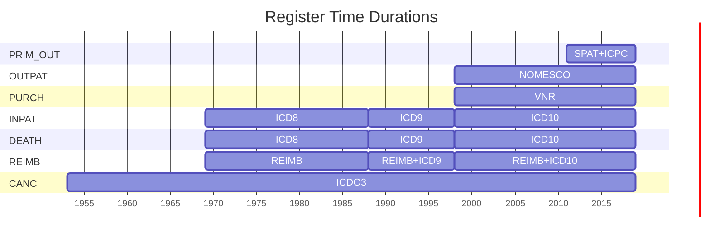

# Appendix: Registers time duration

```mermaid 
---
displayMode: compact
---
gantt
    title Register Time Durations
    dateFormat YYYY
    axisFormat %Y

    section PRIM_OUT
    SPAT+ICPC       : 2011, 2019

    section OUTPAT
    NOMESCO         : 1998, 2019

    section PURCH
    VNR         : 1998, 2019

    section INPAT
    ICD8         : 1969, 1988
    ICD9         : 1988, 1998
    ICD10        : 1998, 2019

    section DEATH
    ICD8         : 1969, 1988
    ICD9         : 1988, 1998
    ICD10        : 1998, 2019

    section REIMB
    REIMB         : 1969, 1988
    REIMB+ICD9   : 1988, 1998
    REIMB+ICD10  : 1998, 2019

    section CANC
    ICDO3            : 1953, 2019
```