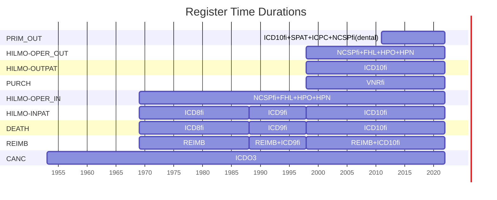

# Appendix: Registers time duration

Following plot shows the start and end of each source register and the vocabularies used during these periods. 

Hilmo register has been broken in to 4 parts corresponding to the internal labels of the register. 

