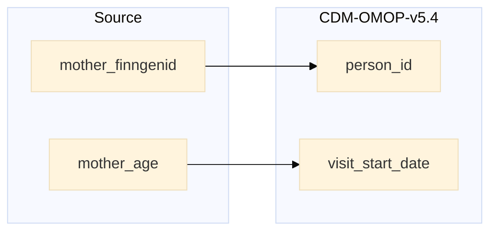

## birth_mother to visit_occurrence

| Destination Field | Source field | Logic | Comment field |
| --- | --- | --- | --- |
| visit_occurrence_id |  | Incremental integer.  Unique value per `mother_finngenid` + 100000000000 (offset). | Generated |
| person_id | finngenid | `person_id` from person table where `person_source_value` equals `mother_finngenid` | Calculated |
| visit_concept_id |  | `concept_id_2` from concept_relationship table where `concept_id_1` equals `visit_source_concept_id` and `relationship_id` equals "Maps to". | Calculated   NOTE: 0 when `visit_source_concept_id` is NULL |
| visit_start_date | mother_age | `approx_delivery_date` is calculated as by adding mother_age to approx_birth_date from finngenid_info table. | Calculated |
| visit_start_datetime |  | Calculated from  `visit_start_date` with time 00:00:0000 | Calculated |
| visit_end_date |  | copied from `approx_delivery_date`  | Copied |
| visit_end_datetime |  | Calculated from  `visit_end_date` with time 00:00:0000 | Calculated|
| visit_type_concept_id |  | Set 32879  - 'Registry' for all | Calculated |
| provider_id |  | Set 0 for all | Info not available |
| care_site_id |  | Set 0 for all | Info not available |
| visit_source_value |  | String build as  "SOURCE=BIRTH_MOTHER;INDEX=" | Calculated |
| visit_source_concept_id |  | `omop_concept_id` from fg_codes_info where `source` equals "BIRTH_MOTHER" | Calculated using the fg_codes_info table. |
| admitted_from_concept_id |  | Set 0 for all | Info not available |
| admitted_from_source_value |  | Set NULL for all | Info not available |
| discharged_to_concept_id |  | Set 0 for all | Info not available|
| discharged_to_source_value |  | Set NULL for all | Info not available |
| preceding_visit_occurrence_id |  | Set 0 for all | Info not available |
