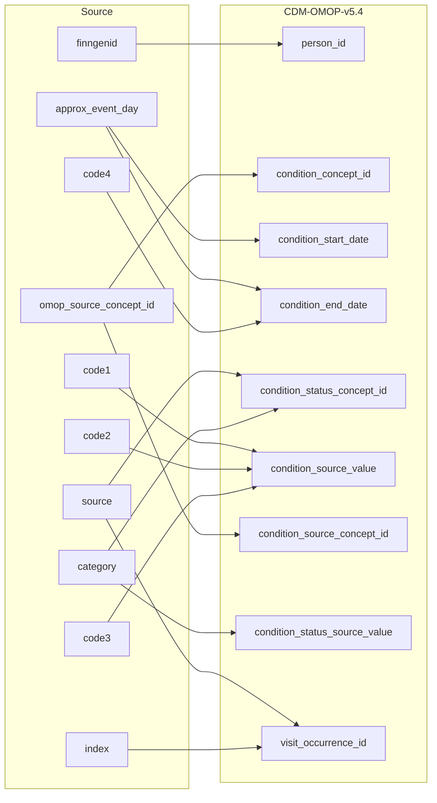

## Table name: condition_occurrence

### Reading from stem_table

| Destination Field | Source field | Logic | Comment field |
| --- | --- | --- | --- |
| condition_occurrence_id |  |  | Generated:   Incremental integer.   Unique value per each row condition_occurence. |
| person_id | finngenid |  | Calculated:  person.person_id where person.person_source_value is stem.finngenid |
| condition_concept_id | omop_source_concept_id |  | Calculated:  From joining stem.omop_source_concept_id to cdm.concept_relationship.concept_id_2 "Maps to" concept_id for all events where standard code domain is condition or (when standard code domain is NULL and stem.default_domain LIKE condition).   0 if not standard concept_id is found. Note: If more than one standard concept_id maps to the non-standard one row is added per  standard concept_id |
| condition_start_date | approx_event_day |  | Calculated:  stem.approx_event_day |
| condition_start_datetime |  |  | Calculated:  condition_occurence.condition_start_date with time 00:00:0000 |
| condition_end_date | approx_event_day code4 |  | Calculated:  If stem.source is hilmo and stem.code4 is not null then condition_occurence.condition_start_date + stem.code4  else condition_occurence.condition_start_date |
| condition_end_datetime |  |  | Calculated:  condition_occurence.condition_end_date with time 00:00:0000 |
| condition_type_concept_id |  |  | Calculated:  Set 32879-Registry for all |
| condition_status_concept_id | source category |  | Calculated:    For  stem.source is INPAT or OUTPAT  - if number in stem.category = 0 then 32902-Primary diagnosis  - if number in stem.category > 1 then 32908-Secondary diagnosis  - if number in stem.category = EX OR stem.category = EX0:N then 32895-Death diagnosis  For stem.source is DEATH:  - if stem.category = U then 32911-Underlying cause of death  - if stem.category =  I then 32897-Immediate cause of death  - if stem.category = c1 or c2 or c3 or c4 then 32894-Contributory cause of death   FOR stem.source is REIMB: - all as 32893-Confirmed diagnosis  For stem.source is CANC: - all as 32902-Primary diagnosis  For stem.source is PRIM_OUT - if code in stem.category =  ICD0 or ICP0 then 32902-Primary diagnosis  - if number in stem.category = ICD1:N OR stem.category = ICP1:N then 32908-Secondary diagnosis |
| stop_reason |  |  | Info not available:   set NULL |
| provider_id |  |  | Same as parent visit_occurence.provider_id |
| visit_occurrence_id | source index |  | Calculated:   Link to correspondent visit_occurence.visit_occurrence_id calulated from stem.source+stem.index. |
| visit_detail_id |  |  | Info not available:   set NULL |
| condition_source_value | code1 code2 code3 |  | Calculated:   String made as "CODE1=<stem.code1>;CODE2=<stem.code2>;CODE3=<stem.code3>" |
| condition_source_concept_id | omop_source_concept_id |  | Calculated:  If stem.omop_source_concept_id is not null then stem.omop_source_concept_id  ELSE 0 |
| condition_status_source_value | category |  | Calculated:     Copy CATEGORY as it is |