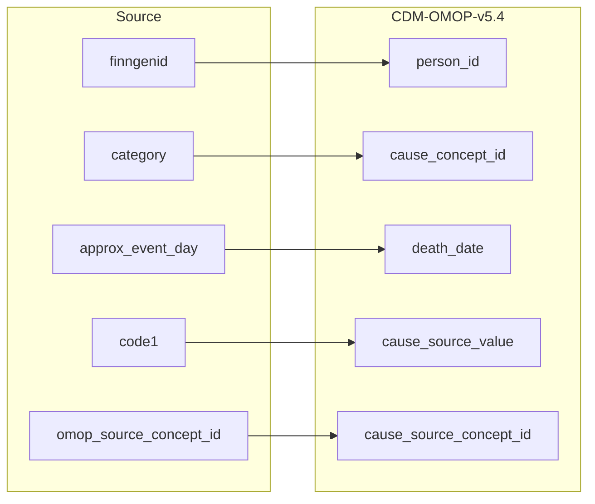

## Table name: death

### Reading from stem_table

| Destination Field | Source field | Logic | Comment field |
| --- | --- | --- | --- |
| person_id | finngenid | `person_id` from person table where `person_source_value` equals `finngenid` |   Calculated |
| death_date | approx_event_day | Copied from `approx_event_day` | Copied |
| death_datetime |  | Calculated from  `death_date` with time 00:00:0000 | Calculated |
| death_type_concept_id |  | Set 32879 - 'Registry' for all | Calculated |
| cause_concept_id | category | Add priority for cause of death using `category` and select the top priority.  The priority for cause of death is as follows: I > U > c1 > c2 > c3 > c4. `concept_id_2` from concept_relationship table where `concept_id_1` equals `cause_source_concept_id` and `relationship_id` equals "Maps to" | Calculated   NOTE: IF a `cause_source_concept_id` has more than one standard mapping (`concept_id_2`), one row is added per each additional `cause_concept_id` |
| cause_source_value | code1 | Copied `code1` as it is | Copied |
| cause_source_concept_id | omop_source_concept_id | IF `omop_source_concept_id` is not null then `omop_source_concept_id`  ELSE 0 | Calculated |

