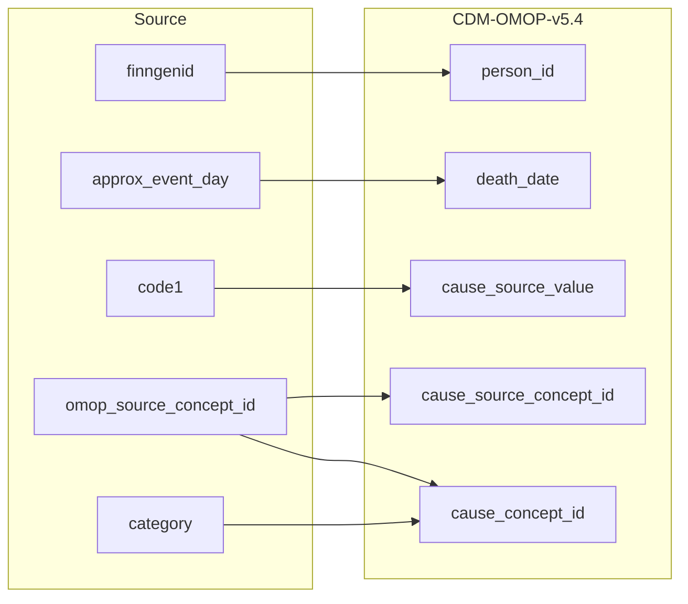

## Table name: death

### Reading from stem_table

| Destination Field | Source field | Logic | Comment field |
| --- | --- | --- | --- |
| person_id | finngenid |  | Calculated:  person.person_id where person.source_person_id is source.death_register.finngenid |
| death_date | approx_event_day |  | Calculated:  Based on APPROX_EVENT_DATE |
| death_datetime |  |  | Calculated:  death.death_date with time 00:00:0000 |
| death_type_concept_id |  |  | Calculated:  Set 32879-Registry for all |
| cause_concept_id | omop_source_concept_id category |  | Calculated:  Add priority for cause of death using stem.category and select the top priority.  The priority for cause of death is as follows: I > U > c1 > c2 > c3 > c4  0 if not standard concept_id is found. |
| cause_source_value | code1 |  | Calculated:   Copy as it is in stem.code1 |
| cause_source_concept_id | omop_source_concept_id |  | Calculated:  If stem.omop_source_concept_id is not null then stem.omop_source_concept_id  Else 0 |

