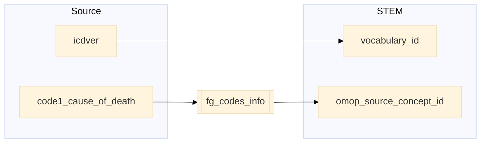

## death_register to stem

| Destination Field | Source field | Logic | Comment field |
| --- | --- | --- | --- |
| finngenid | finngenid | Copied as it is | Copied |
| source | source |  Copied as it is | Copied |
| approx_event_day | approx_event_day | Copied as it is | Copied |
| code1 | code1_cause_of_death | Copied as it is | Copied |
| code2 |  | Set NULL for all | Info not available |
| code3 |  | Set NULL for all | Info not available |
| code4 |  | Set NULL for all | Info not available |
| category | category | Copied as it is | Copied |
| index | index | Copied as it is | Copied |
| code |  |`code` from fg_codes_info where `vocabulary_id`=`vocabulary_id` and `code1`=`fg_code1` | Calculated|
| vocabulary_id | icdver | If `icdver` equals "10" then `vocabulary_id` equals "ICD10fi".  If `icdver` equals "9" then `vocabulary_id` equals "ICD9fi".   If `icdver` equals "8" then `vocabulary_id` equals "ICD8fi". | Calculated |
| omop_source_concept_id | | `omop_concept_id` from fg_codes_info where `vocabulary_id`=`vocabulary_id` and `code1`=`fg_code1` | Calculated|
| default_domain |  | Default domain is "condition"| Calculated |
