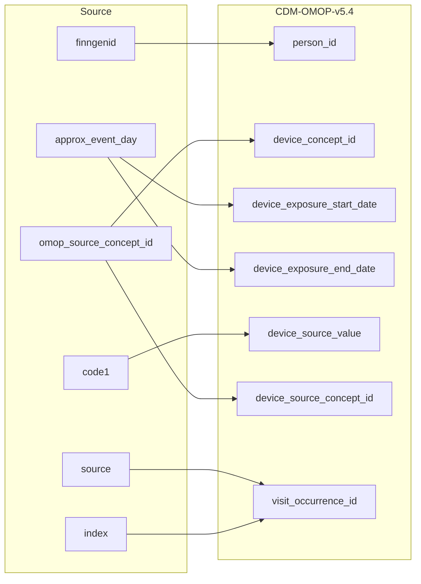

## Table name: device_exposure

### Reading from stem_table

| Destination Field | Source field | Logic | Comment field |
| --- | --- | --- | --- |
| device_exposure_id |  |  | Generated:   Incremental integer.   Unique value per each row device. |
| person_id | finngenid |  | Calculated:  person.person_id where person.person_source_value is stem.finngenid |
| device_concept_id | omop_source_concept_id |  | Calculated:  From joining stem.omop_source_concept_id to cdm.concept_relationship.concept_id_2 "Maps to" concept_id for all events where standard code domain is device or (when standard code domain is NULL and stem.default_domain LIKE device).   0 if not standard concept_id is found. Note: If more than one standard concept_id maps to the non-standard one row is added per  standard concept_id |
| device_exposure_start_date | approx_event_day |  | Calculated:  stem.approx_event_day |
| device_exposure_start_datetime |  |  | Calculated:  device_exposure.device_exposure_start_date with time 00:00:0000 |
| device_exposure_end_date | approx_event_day |  | Calculated:  stem.approx_event_day |
| device_exposure_end_datetime |  |  | Calculated:  device_exposure.device_exposure_end_date with time 00:00:0000 |
| device_type_concept_id |  |  | Calculated:  Set 32879-Registry for all |
| unique_device_id |  |  | Info not available:   set NULL |
| production_id |  |  | Info not available:   set NULL |
| quantity | quantity |  | Info not available:   set NULL |
| provider_id |  |  | Calculated:   Same as parent visit_occurence.provider_id |
| visit_occurrence_id | source index |  | Calculated:   Link to correspondent visit_occurence.visit_occurrence_id calulated from stem.source+stem.index. |
| visit_detail_id |  |  | Info not available:   set NULL |
| device_source_value | code1 |  | Calculated:   Copy as it is in stem.code1 |
| device_source_concept_id | omop_source_concept_id |  | Calculated:  If stem.omop_source_concept_id is not null then stem.omop_source_concept_id  Else 0 |
| unit_concept_id |  |  | Info not available:   set 0 |
| unit_source_value |  |  | Info not available:   set NULL |
| unit_source_concept_id |  |  | Info not available:   set 0 |

