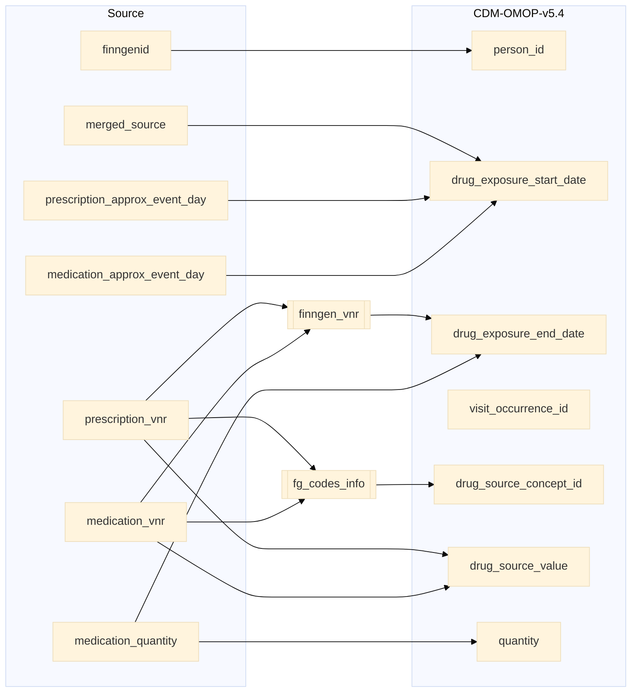

## drug_events to drug_exposure

| Destination Field | Source field | Logic | Comment field |
| --- | --- | --- | --- |
| drug_exposure_id |  |   Incremental integer.    Unique value per each row in drug_exposure |  Generated |
| person_id | finngenid | `person_id` from person table where `person_source_value` equals `finngenid` | Calculated |
| drug_concept_id | |  `concept_id_2` from concept_relationship table where `concept_id_1` equals `drug_source_concept_id` and `relationship_id` equals "Maps to"  | Calculated |
| drug_exposure_start_date |  merged_source prescription_approx_event_day medication_approx_event_day | `merged_source` equals "PRESCRIPTION" then `prescription_approx_event_day` else `medication_approx_event_day` | Calculated |
| drug_exposure_start_datetime | | Calculated from  `drug_exposure_start_date` with time 00:00:0000 | Calculated |
| drug_exposure_end_date |   prescription_vnr medication_vnr medication_quantity finngen_vnr | `medication_vnr` and `prescription_vnr` is looked up in finngen_vnr to get `DDDPerPack` which is considered as days_supply. `drug_exposure_end_date` = `durg_exposure_start_date` + `DDDPerPack` * `medication_quantity`. | Calculated |
| drug_exposure_end_datetime |  | Calculated from  `drug_exposure_end_date` with time 00:00:0000 | Calculated |
| verbatim_end_date |  | Set NULL for all  | Info not available |
| drug_type_concept_id |  |  Set 32879  - 'Registry' for all | Calculated |
| stop_reason |  | Set NULL for all  | Info not available |
| refills |  | Set NULL for all  | Info not available |
| quantity | medication_quantity | Copied from `medication_quantity` | Copied |
| days_supply | | Set 1 for all  |  |
| sig |  | `concept_name` from concept_relationship table where `concept_id_1` equals `omop_concept_id` from fg_codes_info table and `relationship_id` equals "Maps to" | Calculated |
| route_concept_id |  | TODO: From vocabulary tables | Calculated  |
| lot_number |  | Set NULL for all | Info not available   |
| provider_id |  | Same as parent visit_occurence.provider_id  | Calculated |
| visit_occurrence_id | |  `visit_occurrence_id` from visit_occurrence table where `visit_occurrence_id` equals "SOURCE=`PURCH`;INDEX=" | Calculated |
| visit_detail_id |  | Set NULL for all | Info not available   |
| drug_source_value | prescription_vnr medication_vnr |  Copied adding 6 leading zeroes (LPAD(drug_events.prescription_vnr,6,'0') OR LPAD(drug_events.medication_vnr,6,'0')) | Copied   |
| drug_source_concept_id | prescription_vnr medication_vnr | `omop_concept_id` from fg_codes_info where `source` equals "PURCH" `prescription_vnr` equals `FG_CODE3` OR `medication_vnr` equals `FG_CODE3`  |  Calculated   |
| route_source_value |  | Set NULL for all | Info not available   |
| dose_unit_source_value | | Set NULL for all | Info not available   |