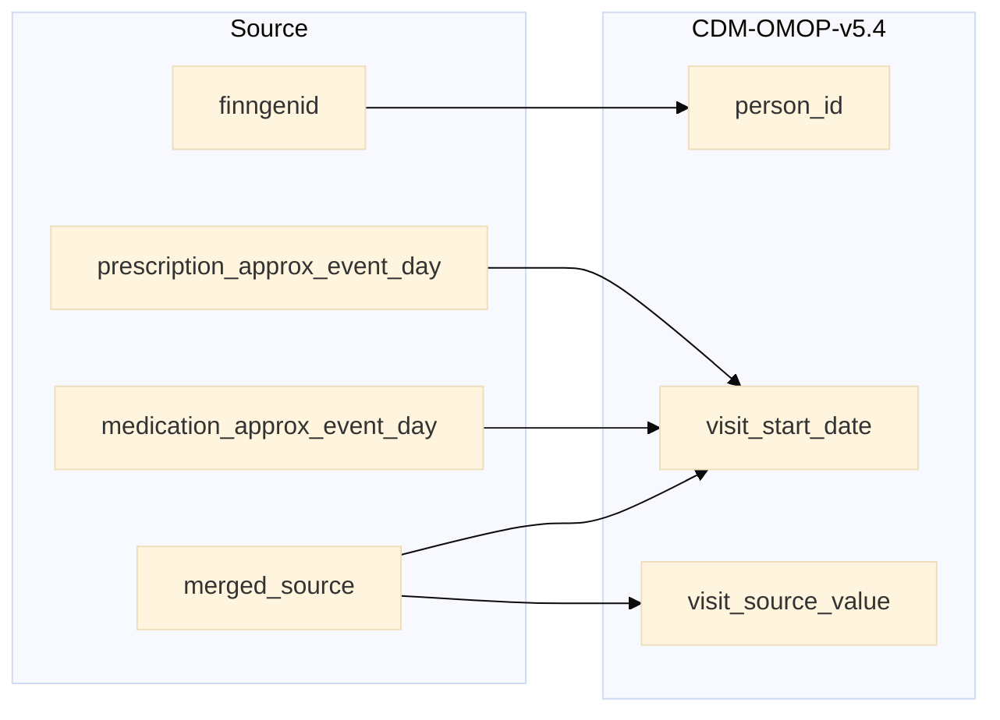

## drug_events to visit_occurrence

| Destination Field | Source field | Logic | Comment field |
| --- | --- | --- | --- |
| visit_occurrence_id |  |  Incremental integer.     Unique value per combination of `source`+`index` | Generated |
| person_id | finngenid | `person_id` from person table where `person_source_value` equals `finngenid` |   Calculated|
| visit_concept_id |  | `concept_id_2` from concept_relationship table where `concept_id_1` equals `visit_source_concept_id` and `relationship_id` equals "Maps to".  | Calculated   NOTE: 0 when `visit_source_concept_id` is NULL |
| visit_start_date |  merged_source prescription_approx_event_day medication_approx_event_day | `merged_source` equals "PRESCRIPTION" then `prescription_approx_event_day` else `medication_approx_event_day`  | Calculated |
| visit_start_datetime |  | Calculated from  `visit_start_date` with time 00:00:0000 | Calculated |
| visit_end_date |  | Copied from `visit_start_date` | Copied   NOTE: There is no `visit_end_date` in the source data, it is set same as `visit_start_date` |
| visit_end_datetime |  | Calculated from  `visit_end_date` with time 00:00:0000 | Calculated |
| visit_type_concept_id |  |  Set 32879  - 'Registry' for all | Calculated |
| provider_id |  | Set 0 for all | Info not available|
| care_site_id |  | Set 0 for all | Info not available|
| visit_source_value |  |  Calculated from `merged_source` as  "SOURCE=`merged_source`;INDEX=`INDEX`" | Calculated|
| visit_source_concept_id |  | `omop_source_concept_id` from fg_codes_info where `source` IN ("PRESCRIPTION", "DELIVERY", "KELA", "PRESCRIPTION_DELIVERY", "DELIVERY_KELA", "PRESCRIPTION_DELIVERY_KELA") and `vocabulary_id` equals "FGvisitType"   ELSE 0  | Calculated using the fg_codes_info table |
| admitted_from_concept_id |  | Set 0 for all  | Info not available  |
| admitted_from_source_value |  | Set NULL for all  | Info not available |
| discharged_to_concept_id |  | Set 0 for all | Info not available   |
| discharged_to_source_value |  | Set NULL for all | Info not available   |
| preceding_visit_occurrence_id |  | Set 0 for all  | Info not available   |
