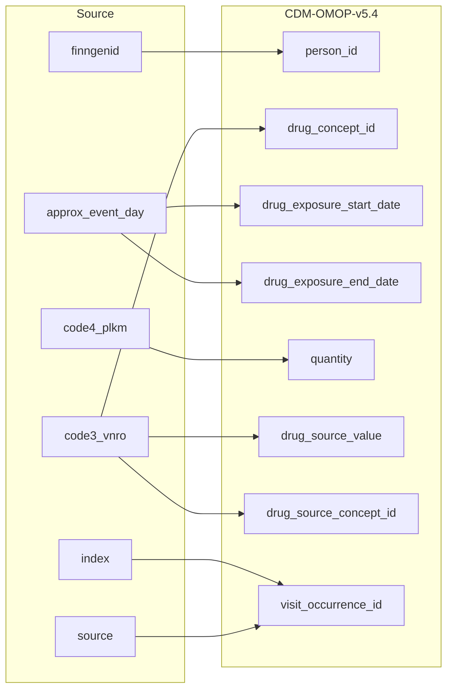

## Table name: drug_exposure

### Reading from purch

| Destination Field | Source field | Logic | Comment field |
| --- | --- | --- | --- |
| drug_exposure_id |  |  | Generated:   Incremental integer.   Unique value per each row drug_exposure for each source.person.person_id |
| person_id | finngenid |  | Calculated:  person.person_id where person.person_source_value is source.purch.finngenid |
| drug_concept_id | code3_vnro |  | Calculated:  Extract medical_codes.fg_codes_info.omop_source_concept_id when source.code3_vnro is medical_codes.fg_codes_info.fg_code1.  When medical_codes.fg_codes_info.omop_source_concept_id is cdm.concept_relationship.concept_id_1 for relationship_id "Maps to" then standard concept_id is extracted.   0 if not standard concept_id is found. |
| drug_exposure_start_date | approx_event_day |  | Calculated:  source.purch.approx_event_day |
| drug_exposure_start_datetime |  |  | Calculated:  drug_exposure.drug_exposure_start_date with time 00:00:0000. |
| drug_exposure_end_date | approx_event_day |  |  Calculated:  source.purch.approx_event_day |
| drug_exposure_end_datetime |  |  | Calculated:  drug_exposure.drug_exposure_end_date with time 00:00:0000. |
| verbatim_end_date |  |  | Info not available:   set NULL for all |
| drug_type_concept_id |  |  | Calculated:  Set 32879-Registry for all |
| stop_reason |  |  | Info not available:   set NULL for all |
| refills |  |  | Info not available:   set NULL for all |
| quantity | code4_plkm |  | Calculated:  If source.code4_plkm is not NULL then source.code4_plkm. ELSE NULL |
| days_supply |  |  | Info not available:  Set to 1 for all |
| sig |  |  | Calculated:   Copied from finngen_vnr_v1.MedicineNameFull |
| route_concept_id |  |  | Calculated:  From vocabulary tables |
| lot_number |  |  | Info not available:  set NULL |
| provider_id |  |  | Same as parent visit_occurence.provider_id |
| visit_occurrence_id | index source |  | Calculated:   Link to correspondent visit_occurence.visit_occurrence_id calulated from SOURCE+INDEX. |
| visit_detail_id |  |  | Info not available:  set NULL |
| drug_source_value | code3_vnro |  | Calculated:   Copy as it is in LPAD(purch.code3_vnro,6,'0') |
| drug_source_concept_id | code3_vnro |  | Calculated:   Extract medical_codes.fg_codes_info.omop_source_concept_id when source.code3_vnro is medical_codes.fg_codes_info.fg_code1.  0 when no such connection exists |
| route_source_value |  |  | Info not available:  set NULL |
| dose_unit_source_value |  |  | Info not available:  set NULL |