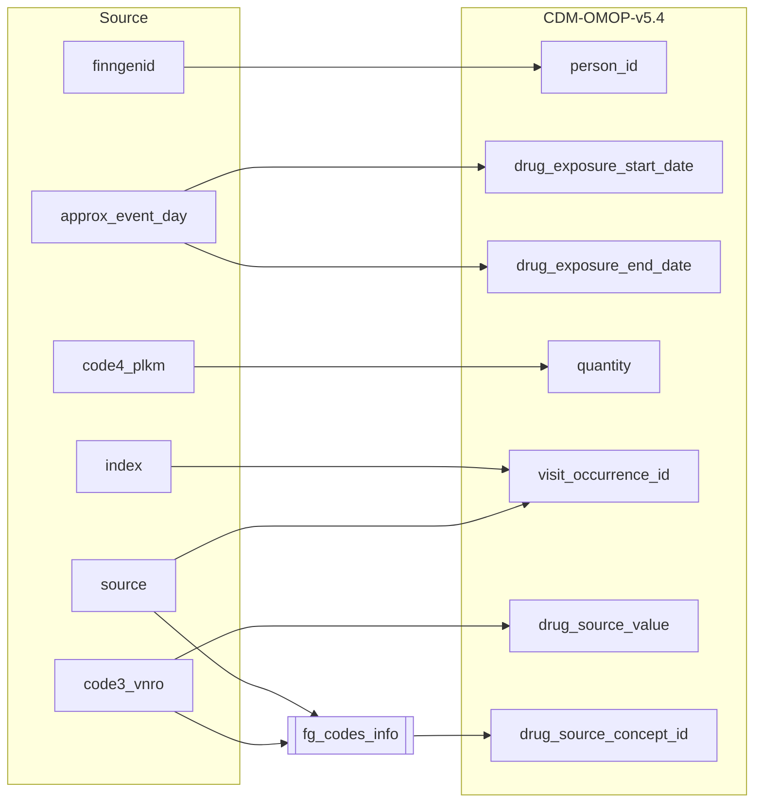

## Table name: drug_exposure

### Reading from purch

| Destination Field | Source field | Logic | Comment field |
| --- | --- | --- | --- |
| drug_exposure_id |  |   Incremental integer.    Unique value per each row in drug_exposure |  Generated |
| person_id | finngenid | `person_id` from person table where `person.person_source_value` equals `finngenid` | Calculated |
| drug_concept_id | |  `concept_id_2` from concept_relationship table where `concept_id_1` equals `drug_source_concept_id` and `relationship_id` equals "Maps to"  | Calculated |
| drug_exposure_start_date | approx_event_day | Copied from `approx_event_day` | Calculated |
| drug_exposure_start_datetime | | Calculated from  `visit_start_date` with time 00:00:0000 | Calculated |
| drug_exposure_end_date |  approx_event_day | Copied from `approx_event_day` | Calculated   NOTE: There is not `visit_end_date` in the source data, it is set same as `visit_end_date` |
| drug_exposure_end_datetime |  | Calculated from  `visit_end_date` with time 00:00:0000 | Calculated |
| verbatim_end_date |  | Set NULL for all  | Info not available |
| drug_type_concept_id |  |  Set 32879  - 'Registry' for all | Calculated |
| stop_reason |  | Set NULL for all  | Info not available |
| refills |  | Set NULL for all  | Info not available |
| quantity | code4_plkm | TODO | Calculated |
| days_supply | | Set 1 for all  | Info potentially available   NOTE: this can be infer using some standard algorithms  |
| sig |  | TODO | |
| route_concept_id |  | TODO: From vocabulary tables | Calculated  |
| lot_number |  | Set NULL for all | Info not available   |
| provider_id |  | Same as parent visit_occurence.provider_id  | Calculated |
| visit_occurrence_id | index source |  `visit_occurrence_id` from visit_occurrence table where `visit_occurrence.visit_occurrence_id` equals "SOURCE=`source`;INDEX=`index`" | Calculated |
| visit_detail_id |  | Set NULL for all | Info not available   |
| drug_source_value | code3_vnro |  Copied adding 6 leading zeroes (LPAD(purch.code3_vnro,6,'0')) | Calculated   |
| drug_source_concept_id | code3_vnro |  |  `omop_concept_id` from fg_codes_info where `source` equals "PURCH" `code3_vnro` equals `FG_CODE3`   |
| route_source_value |  | Set NULL for all | Info not available   |
| dose_unit_source_value | | Set NULL for all | Info not available   |