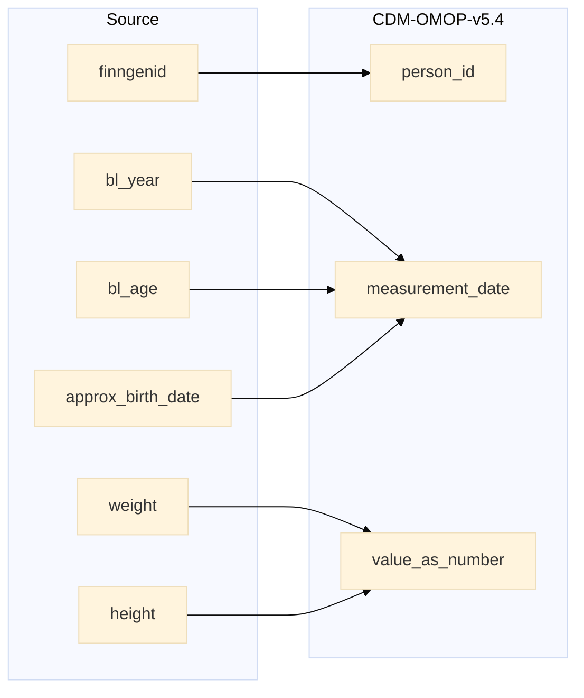

## finngenid_info to measurement

| Destination Field | Source field | Logic | Comment field |
| --- | --- | --- | --- |
| measurement_id |  | Incremental integer. Unique value per each row measurement + 111000000000 (offset) | Generated |
| person_id | finngenid | `person_id` from person table where `person_source_value` equals `finngenid` |   Calculated |
| measurement_concept_id |  | `concept_id_2` from concept_relationship table where `concept_id_1` equals `observation_source_concept_id` and `relationship_id` equals "Maps to" and `domain_id` is "Measurement" | Calculated   NOTE: 0 when `measurement_source_concept_id` is NULL  |
| measurement_date | bl_year bl_age approx_birth_date | If approx_birth_date is null and bl_year is not null then `measurement_date` is simply bl_year. Else `measurement_date` is calulcated by adding bl_age to approx_birth_date. | Calculated |
| measurement_datetime |  | Calculated from  `measurement_date` with time 00:00:0000 | Calculated |
| measurement_time |  | Set 00:00:0000 for all | Calculated |
| measurement_type_concept_id |  | Set 32879 - 'Registry' for all | Calculated |
| operator_concept_id |  | Set 0 for all | Info not available |
| value_as_number | height weight | If weight is not null then BMI is calculated by the below formula   weight / ((height/100) * (height/100)) and rounded to 2 decimals  If weight is null then copy height | Calculated |
| value_as_concept_id |  | Set 0 for all | Info not available |
| unit_concept_id |  | `concept_id_2` from concept_relationship table where `concept_id_1` equals `unit_source_concept_id` and `relationship_id` equals "Maps to" and  `domain_id` equals "Unit". 0 if standard concept_id is not found.  | Calculated |
| range_low |  | Set NULL for all | Info not available |
| range_high |  | Set NULL for all | Info not available |
| provider_id |  | `provider_id` for mapped `visit_occurrence_id` from visit_occurrence table. | Calculated |
| visit_occurrence_id |  | Link to correspondent `visit_occurrence_id` from visit_occurrence table where `visit_source_value` equals "SOURCE=BIOBANK;INDEX=". | Calculated |
| visit_detail_id |  | Set NULL for all | Info not available |
| measurement_source_value |  | When weight is not null then 'BMI' as SOURCE  When weight is null then 'HEIGHT' as SOURCE | Calculated |
| measurement_source_concept_id |  | `omop_source_concept_id` from fg_codes_info where `source` IN ("BMI", "HEIGHT") and `vocabulary_id` equals "FGvisitType"   ELSE 0 | Calculated |
| unit_source_value |  | When weight is null then "cm" else null | Calculated |
| unit_source_concept_id |  | `omop_source_concept_id` from fg_codes_info where `source` equals "HEIGHT" and `concept_code` equals "cm"   ELSE 0 | Calculated |
| value_source_value |  | Set NULL for all | Info not available |
| measurement_event_id |  | Set NULL for all | Info not available |
| meas_event_field_concept_id |  | Set 0 for all | Info not available |

