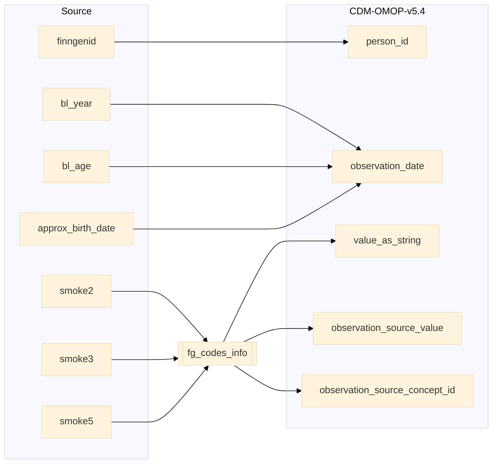

## finngenid_info to observation

| Destination Field | Source field | Logic | Comment field |
| --- | --- | --- | --- |
| observation_id |  | Incremental integer. Unique value per each row observation + 112000000000 (offset). | Generated |
| person_id | finngenid | `person_id` from person table where `person_source_value` equals `finngenid` |   Calculated |
| observation_concept_id |  | `concept_id_2` from concept_relationship table where `concept_id_1` equals `observation_source_concept_id` and `relationship_id` equals "Maps to" and `domain_id` is "Observation" | Calculated   NOTE: 0 when `observation_source_concept_id` is NULL |
| observation_date | bl_year bl_age approx_birth_date | Calulcated from approx_birth_date, bl_year and bl_age.  If approx_birth_date is null and bl_year is not null then `observation_date` is simply bl_year. Else `observation_date` is calulcated by adding bl_age to approx_birth_date. | Calculated |
| observation_datetime |  | Calculated from  `observation_date` with time 00:00:0000 | Calculated |
| observation_type_concept_id |  | Set 32879 - 'Registry' for all | Calculated |
| value_as_number |  | Set NULL for all | Info not available |
| value_as_string | smoke2 smoke3 smoke5 | `name_en` from fg_codes_info where `source`=`source` and `smoke2`=`fg_code1` and `smoke3`=`fg_code2` and `smoke5`=`fg_code3` | Calculated |
| value_as_concept_id |  | Set 0 for all | Info not available |
| qualifier_concept_id |  | Set 0 for all | Info not available |
| unit_concept_id |  | Set 0 for all | Info not available |
| provider_id |  | `provider_id` for mapped `visit_occurrence_id` from visit_occurrence table. | Calculated |
| visit_occurrence_id | | Link to correspondent `visit_occurrence_id` from visit_occurrence table where `visit_source_value` equals "SOURCE=BIOBANK;INDEX=". | Calculated |
| visit_detail_id |  | Set NULL for all | Info not available |
| observation_source_value | smoke2 smoke3 smoke5 | `code` from fg_codes_info where `source`=`source` and `smoke2`=`fg_code1` and `smoke3`=`fg_code2` and `smoke5`=`fg_code3` | Calculated |
| observation_source_concept_id | smoke2 smoke3 smoke5 | `omop_source_concept_id` from fg_codes_info where `source`=`source` and `smoke2`=`fg_code1` and `smoke3`=`fg_code2` and `smoke5`=`fg_code3` | Calculated |
| unit_source_value |  | Set NULL for all | Info not available |
| qualifier_source_value |  | Set NULL for all | Info not available |
| value_source_value |  | Set NULL for all | Info not available |
| observation_event_id |  | Set NULL for all | Info not available |
| obs_event_field_concept_id |  | Set 0 for all | Info not available |
