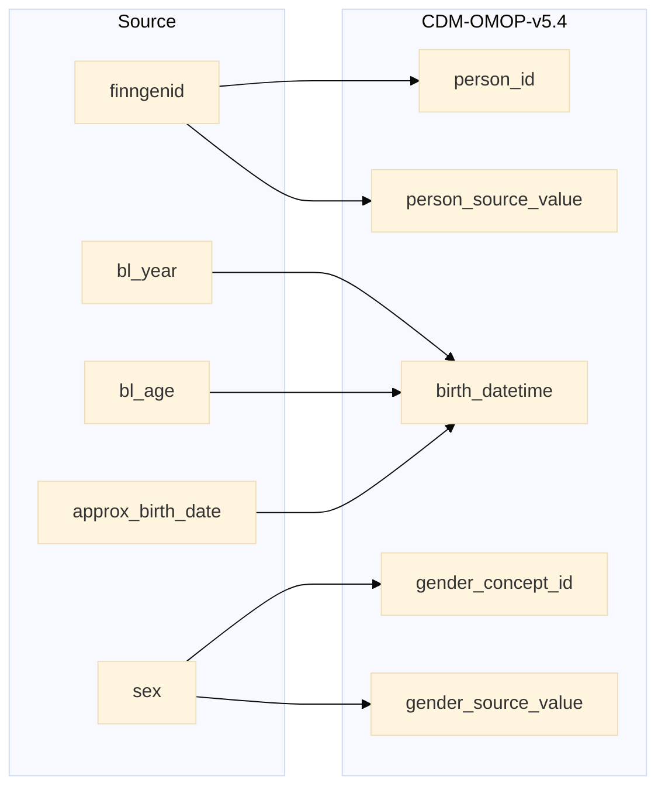

## finngenid_info to person

| Destination Field | Source field | Logic | Comment field |
| --- | --- | --- | --- |
| person_id | finngenid |  Incremental integer.    Unique `person_id` per each `finngenid` | Generated |
| gender_concept_id | sex |   If `sex` is 'male' then `gender_concept_id` is 8507    If `sex` is 'female' then `gender_concept_id` is 8532   other wise 0 | Calculated|
| year_of_birth |  |   Calculated from `person.birth_datetime` | Calculated |
| month_of_birth |  | Calculated from `person.birth_datetime` | Calculated |
| day_of_birth |  | Calculated from `person.birth_datetime` | Calculated|
| birth_datetime | approx_birth_date bl_year bl_age | Copied from `approx_birth_date`    If `approx_birth_date` is null then `birth_datetime` is calculated substracting `bl_age` from `bl_year` | Calculated|
| race_concept_id |  | Set 0 for all | Info not available |
| ethnicity_concept_id |  | Set 0 for all | Info not available|
| location_id |  | Set 0 for all | Info potentially available:    Possibly in `source.finngenid_info.regionofbirth` |
| provider_id |  |  Set 0 for all | Info not available|
| care_site_id |  | Set 0 for all | Info not available |
| person_source_value | finngenid | Verbatim from `finngenid` | Calculated|
| gender_source_value | sex | Verbatim from `sex` | Calculated |
| gender_source_concept_id | | Set 0 for all | Info not available |
| race_source_value |  | Set NULL for all | Info not available | 
| race_source_concept_id | |  Set 0 for all| Info not available |
| ethnicity_source_value | | Set NULL for all | Info not available|
| ethnicity_source_concept_id | | Set 0 for all. | Info not available |

