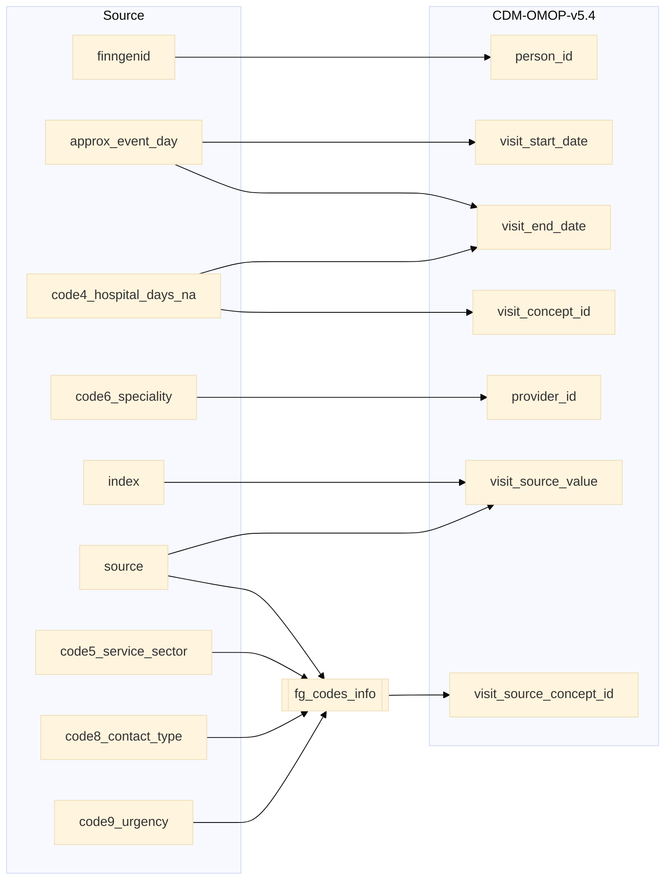

## hilmo to visit_occurrence

| Destination Field | Source field | Logic | Comment field |
| --- | --- | --- | --- |
| visit_occurrence_id |  | Incremental integer.  Unique value per combination of `source`+`index` | Generated |
| person_id | finngenid | `person_id` from person table where `person_source_value` equals `finngenid` | Calculated |
| visit_concept_id | code4_hospital_days_na | `concept_id_2` from concept_relationship table where `concept_id_1` equals `visit_source_concept_id` and `relationship_id` equals "Maps to".  If a `visit_source_concept_id` maps to more than one standard concept_id, then `visit_source_concept_id` chosen based on the number of hospitalisation days `code4_hospital_days_na`. | Calculated   NOTE: 0 when `visit_source_concept_id` is NULL |
| visit_start_date | approx_event_day | copied from `approx_event_day` | Calculated |
| visit_start_datetime |  | Calculated from  `visit_start_date` with time 00:00:0000 | Calculated |
| visit_end_date | approx_event_day code4_hospital_days_na |   `code4_hospital_days` is not null then `approx_event_day` + `code4_hospital_days`.  `code4_hospital_days` is null then `approx_event_day`. | Calculated |
| visit_end_datetime |  | Calculated from  `visit_end_date` with time 00:00:0000 | Calculated|
| visit_type_concept_id |  | Set 32879  - 'Registry' for all | Calculated |
| provider_id | code6_speciality | `provider_id` from provider table where `code6_speciality` equals `speciality_source_value`. | Calculated  NOTE: There is only one `provider_id` per `code6_speciality` |
| care_site_id |  | Set 0 for all | Info not available |
| visit_source_value | source index | String build as  "SOURCE=`source`;INDEX=`index`" | Calculated |
| visit_source_concept_id | source code5_service_sector code8_contact_type code9_urgency | `omop_concept_id` from fg_codes_info based on the conditions: `source` in ("INPAT","OUTPAT","OPER_IN","OPER_OUT"). `code8_contact_type` and `code9_urgency` is NULL then  and  `fg_code5` is `code5_service_sector`. `code8_contact_type` or `code9_urgency` is NOT NULL then `fg_code8` is `code8_contact_type` and `fg_code9` is `code9_urgency`. | Calculated using the fg_codes_info table. NOTE: When no standard map is available then `source` in ("INPAT","OUTPAT","OPER_IN","OPER_OUT"). |
| admitted_from_concept_id |  | Set 0 for all | Info not available |
| admitted_from_source_value |  | Set NULL for all | Info not available |
| discharged_to_concept_id |  | Set 0 for all | Info not available|
| discharged_to_source_value |  | Set NULL for all | Info not available |
| preceding_visit_occurrence_id |  | Set 0 for all | Info not available |

