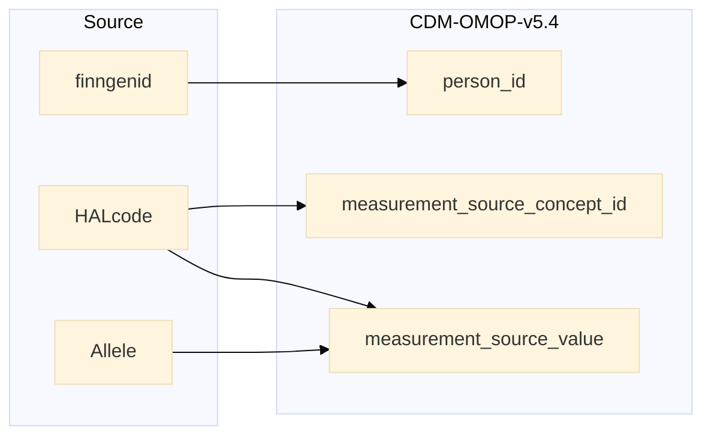

## hla to measurement

| Destination Field | Source field | Logic | Comment field |
| --- | --- | --- | --- |
| measurement_id |  | Incremental integer. Unique value per each row measurement + 119000000000 (offset) | Generated |
| person_id | finngenid | `person_id` from person table where `person_source_value` equals `finngenid` |   Calculated |
| measurement_concept_id |  | Set 0 for all | Info not available |
| measurement_date |  | Set `2025-12-18` for all | Calculated |
| measurement_datetime |  | Copied from  `measurement_date` | Copied |
| measurement_time |  | extract time from `measurement_datetime` for all | Calculated |
| measurement_type_concept_id |  | Set 32879 - 'Registry' for all | Calculated |
| operator_concept_id |  | Set 0 for all | Info not available |
| value_as_number |  | Set NULL for all  | Info not available |
| value_as_concept_id |  | Set 0 for all | Info not available |
| unit_concept_id |  | Set 0 for all  | Info not available |
| range_low |  | Set NULL for all | Info not available |
| range_high |  | Set NULL for all | Info not available |
| provider_id |  | Set NULL for all | Info not available |
| visit_occurrence_id |  | Set NULL for all | No Visit logged |
| visit_detail_id |  | Set NULL for all | Info not available |
| measurement_source_value | HLAcode Allele | Concat `HLAcode` and `Allele` | Calculated |
| measurement_source_concept_id | HLAcode | `omop_concept_id` from concept table where `concept_code` equals `HLAcode` | Calculated |
| unit_source_value |  | Set NULL for all | Info not available |
| unit_source_concept_id |  | Set 0 for all | Info not available |
| value_source_value |  | Set NULL for all | Info not available |
| measurement_event_id |  | Set NULL for all | Info not available |
| meas_event_field_concept_id |  | Set 0 for all | Info not available |

