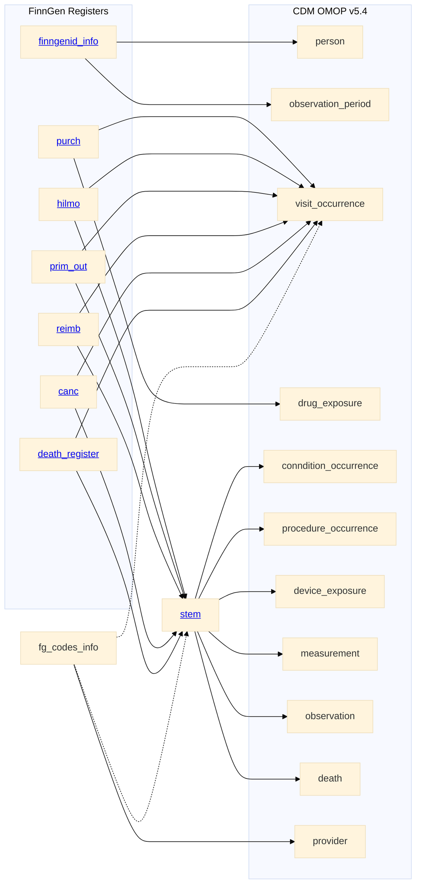

# FinnGen to OMOP CDM v5.4 

In addition to genotype data, FinnGen includes the phenotype data from several national registers. 
This site details how the most relevant registers have been converted to the OMOP CDM v5.4. 

In addition to the international vocabularies provided by OMOP, we use national vocabularies build by the FinOMOP group, and few custom vocabularies build by FinnGen [[Appendix:Vocabularies](appendix_vocabularies.html)]. As a result, most of the events in the clinical data tables have a `source_concept_id` that link to the source non-standard code. This makes the local codes searchable in Atlas and usable in local analysis [^fn1].    

Provided register data has been collected and preprocessed by the Finnish Institute for Health and Welfare (THL). Some of the original columns have been split and some have been merged together. To ease the code mapping, rather than reshape the large provided tables we use a mapping table `fg_codes_info`. 

Moreover, an intermediate `stem` table is used to collects all the medical events. Events are then placed in the different OMOP domain tables based on the domain of the medical code.   

[^fn1]: [M.Philofsky 2019](https://ohdsi.org/wp-content/uploads/2020/10/Melanie-Philofsky-Philofsky-Mapping-Source-Codes-Poster.pdf)
