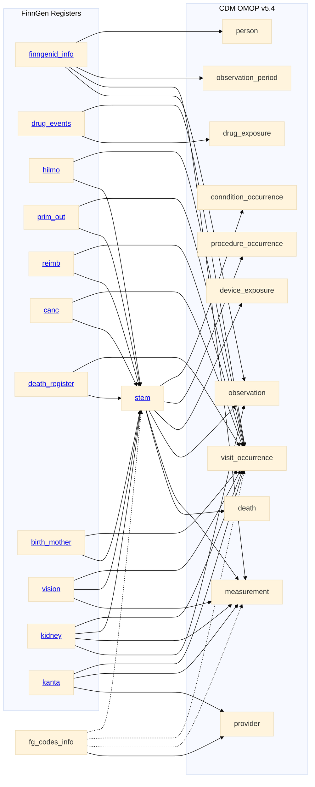

# FinnGen to OMOP CDM v5.4 

In addition to genotype data, FinnGen includes the phenotype data from several national registers. 
This site details how the most relevant registers have been converted to the OMOP CDM v5.4. 

In addition to the international vocabularies provided by OMOP, we use national vocabularies build by the FinOMOP group, and few custom vocabularies build by FinnGen [[Appendix:Vocabularies](appendix_vocabularies.html)]. As a result, most of the events in the clinical data tables have a `source_concept_id` that link to the source non-standard code. This makes the local codes searchable in Atlas and usable in local analysis [^fn1].    

Provided register data has been collected and preprocessed by the Finnish Institute for Health and Welfare (THL). Some of the original columns have been split and some have been merged together. To ease the code mapping, rather than reshape the large provided tables we use a mapping table `fg_codes_info`. 

Moreover, an intermediate `stem` table is used to collects all the medical events. Events are then placed in the different OMOP domain tables based on the domain of the medical code.   

# Registers

## finngenid_info
Also know as `minimum_extended` is a file created by THL to collect participant details. 

- [finngenid_info to person](finngenid_info_to_person.html)
- [finngenid_info to observation_period](finngenid_info_to_observation_period.html)
- [finngenid_info to visit_occurrence](finngenid_info_to_visit_occurrence.html)
- [finngenid_info to measurement](finngenid_info_to_measurement.html)
- [finngenid_info to observation](finngenid_info_to_observation.html)

## drug_events
Drug Events table is a combination of events from three registeries.

- [drug_events to visit_occurrence](drug_events_to_visit_occurrence.html)
- [drug_events to drug_exposure](drug_events_to_drug_exposure.html)

## hilmo
Hilmo register gather the secondary health care diagnose and operations from the country [[FinnGen Handbook](https://finngen.gitbook.io/finngen-analyst-handbook/finngen-data-specifics/red-library-data-individual-level-data/what-phenotype-files-are-available-in-sandbox-1/detailed-longitudinal-data/registers-in-the-detailed-longitudinal-data#hilmo-care-register-for-health-care)]. 

- [hilmo to visit_occurence](hilmo_to_visit_occurrence.html)
- [hilmo to stem](hilmo_to_stem.html)

## prim_out
Avohilmo register gather the primary health care diagnose and operations from the country. 
[[FinnGen Handbook](https://finngen.gitbook.io/finngen-analyst-handbook/finngen-data-specifics/red-library-data-individual-level-data/what-phenotype-files-are-available-in-sandbox-1/detailed-longitudinal-data/registers-in-the-detailed-longitudinal-data#avohilmo-register-of-primary-health-care-visits)]

- [prim_out to visit_occurence](prim_out_to_visit_occurrence.htlm)
- [prim_out to stem](prim_out_to_stem.html)

## reimb
Reimbursement register gathers [[FinnGen Handbook](https://finngen.gitbook.io/finngen-analyst-handbook/finngen-data-specifics/red-library-data-individual-level-data/what-phenotype-files-are-available-in-sandbox-1/detailed-longitudinal-data/registers-in-the-detailed-longitudinal-data#drug-reimbursement-data-the-social-insurance-institution-kela-kansanelaekelaitos)]. 

- [reimb to visit_occurence](reimb_to_visit_occurrence.htlm)
- [reimb to stem](reimb_to_stem.html)

## canc
Cancer register [[FinnGen Handbook](https://finngen.gitbook.io/finngen-analyst-handbook/finngen-data-specifics/red-library-data-individual-level-data/what-phenotype-files-are-available-in-sandbox-1/detailed-longitudinal-data/registers-in-the-detailed-longitudinal-data#finnish-cancer-registry)]. 

- [canc to visit_occurence](canc_to_visit_occurrence.htlm)
- [canc to stem](canc_to_stem.html)

## death_register
Death register [[FinnGen Handbook](https://finngen.gitbook.io/finngen-analyst-handbook/finngen-data-specifics/red-library-data-individual-level-data/what-phenotype-files-are-available-in-sandbox-1/detailed-longitudinal-data/registers-in-the-detailed-longitudinal-data#cause-of-death-data-statistics-finland)]. 

- [death_register to visit_occurence](death_register_to_visit_occurrence.htlm)
- [death_register to stem](death_register_to_stem.html)

## birth_mother
Birth Mother [[FinnGen Handbook](https://finngen.gitbook.io/finngen-analyst-handbook/finngen-data-specifics/red-library-data-individual-level-data/what-phenotype-files-are-available-in-sandbox-1/detailed-longitudinal-data/registers-in-the-detailed-longitudinal-data#cause-of-death-data-statistics-finland)]. 

- [birth_mother to visit_occurence](birth_mother_to_visit_occurrence.html)
- [birth_mother to stem](birth_mother_to_stem.html)

## vision
Vision [[FinnGen Handbook](https://finngen.gitbook.io/finngen-handbook/finngen-data-specifics/red-library-data-individual-level-data/what-phenotype-files-are-available-in-sandbox-1/other-registers/the-finnish-register-of-visual-impairment)]. 

- [vision to visit_occurence](vision_to_visit_occurrence.html)
- [vision to stem](vision_to_stem.html)
- [vision to measurement](vision_to_measurement.html)

## Kidney
Kidney [[FinnGen Handbook](https://finngen.gitbook.io/finngen-handbook/finngen-data-specifics/red-library-data-individual-level-data/what-phenotype-files-are-available-in-sandbox-1/other-registers/finnish-registry-for-kidney-diseases)]. 

- [kidney to visit_occurence](kidney_to_visit_occurrence.html)
- [kidney to stem](kidney_to_stem.html)
- [kidney to observation](kidney_to_observation.html)
- [kidney to measurement](kidney_to_measurement.html)

## Kanta
Kanta [[FinnGen Handbook](https://finngen.gitbook.io/finngen-handbook/finngen-data-specifics/red-library-data-individual-level-data/what-phenotype-files-are-available-in-sandbox-1/kanta-lab-values)]. 

- [kanta to provider](kanta_to_provider.html)
- [kanta to visit_occurence](kanta_to_visit_occurrence.html)
- [kanta to measurement](kanta_to_measurement.html)

## stem

- [stem to condition_occurrence](stem_to_condition_occurrence.html)
- [stem to procedure_occurrence](stem_to_procedure_occurrence.html)
- [stem to device_exposure](stem_to_device_exposure.html)
- [stem to measurement](stem_to_measurement.html)
- [stem to observation](stem_to_observation.html)
- [stem to death](stem_to_death.html)

## Fg_codes_info

- [fg_codes_info to provider](fg_codes_info_to_provider.html)

[^fn1]: [M.Philofsky 2019](https://ohdsi.org/wp-content/uploads/2020/10/Melanie-Philofsky-Philofsky-Mapping-Source-Codes-Poster.pdf)
