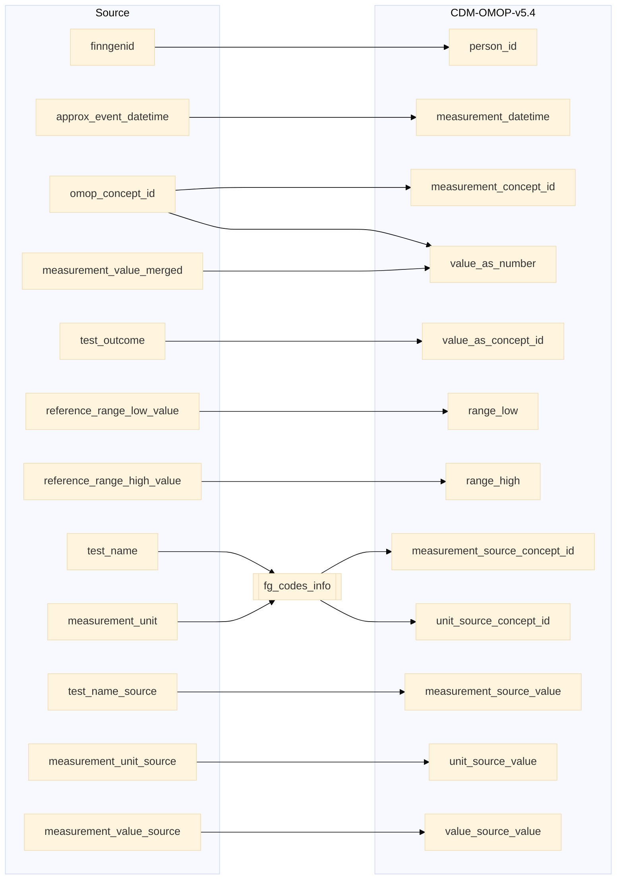

## kanta to measurement

| Destination Field | Source field | Logic | Comment field |
| --- | --- | --- | --- |
| measurement_id |  | Incremental integer. Unique value per each row measurement + 118000000000 (offset) | Generated |
| person_id | finngenid | `person_id` from person table where `person_source_value` equals `finngenid` |   Calculated |
| measurement_concept_id | omop_concept_id | `omop_concept_id` not equals NULL OR `omop_concept_id` not equals -1 then `omop_concept_id` | Calculated   NOTE: 0 when `measurement_source_concept_id` is NULL  |
| measurement_date |  | extract date from `measurement_datetime` for all | Calculated |
| measurement_datetime | approx_event_datetime | Copied from  `approx_event_datetime` | Copied |
| measurement_time |  | extract time from `measurement_datetime` for all | Calculated |
| measurement_type_concept_id |  | Set 32879 - 'Registry' for all | Calculated |
| operator_concept_id |  | Set 0 for all | Calculated |
| value_as_number | omop_concept_id measurement_value_merged | Calculated:  `measurement_value_merged` < 0 and `omop_concept_id` IN [Negative value concept ids](https://ohdsi.github.io/Themis/negative_value_as_number.html) `measurement_value_merged` > 0  | Calculated   NOTE: `value_as_number` can be NULL |
| value_as_concept_id |  | Calculated from `test_outcome`  `test_outcome` equals "N" then 45884153(normal)   `test_outcome` equals "A" then 45878745(abnormal)   `test_outcome` equals "AA" then 36662448(High abnormal)   `test_outcome` equals "L" then 45881666(low)   `test_outcome` equals "LL" then 45879182(Very low)   `test_outcome` equals "H" then 45876384(high)   `test_outcome` equals "HH" then 45879181(Very high) | Info not available |
| unit_concept_id |  | `concept_id_2` from concept_relationship table where `concept_id_1` equals `unit_source_concept_id` and `relationship_id` equals "Maps to" and  `domain_id` equals "Unit". 0 if standard concept_id is not found.  | Calculated |
| range_low | reference_range_low_value | Copied from `reference_range_low_value` | Copied |
| range_high | reference_range_high_value | Copied from `reference_range_high_value` | Copied |
| provider_id |  | `provider_id` for mapped `visit_occurrence_id` from visit_occurrence table. | Calculated |
| visit_occurrence_id |  | Link to correspondent `visit_occurrence_id` from visit_occurrence table where `visit_source_value` equals "SOURCE=KANTA;INDEX=". | Calculated |
| visit_detail_id |  | Set NULL for all | Info not available |
| measurement_source_value | test_name_source | Copied from `test_name_source` | Copied |
| measurement_source_concept_id | test_name measurement_unit | `omop_concept_id` from fg_codes_info where `vocabulary_id` IN ("LABfi_ALL") and CONCAT(`test_name`,`measurement_unit`) equals `code`   ELSE 0 | Calculated |
| unit_source_value | measurement_unit_source | Copied from `measurement_unit_source` | Copied |
| unit_source_concept_id | measurement_unit | `omop_concept_id` from fg_codes_info where `vocabulary_id` IN ("UNITfi") and `measurement_unit` equals `code`   ELSE 0 | Calculated |
| value_source_value | measurement_value_source | Copied from `measurement_value_source` | Copied |
| measurement_event_id |  | Set NULL for all | Info not available |
| meas_event_field_concept_id |  | Set 0 for all | Info not available |

