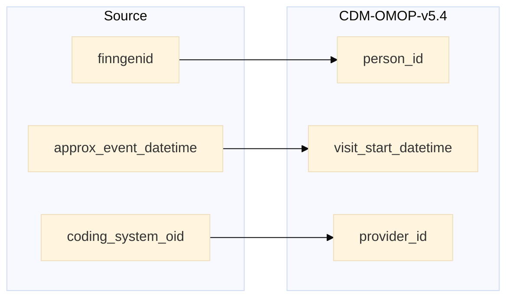

## kanta to visit_occurrence

| Destination Field | Source field | Logic | Comment field |
| --- | --- | --- | --- |
| visit_occurrence_id |  | Incremental integer.  Unique value per `finngenid` + 117000000000 (offset). | Generated |
| person_id | finngenid | `person_id` from person table where `person_source_value` equals `finngenid` | Calculated |
| visit_concept_id |  | `concept_id_2` from concept_relationship table where `concept_id_1` equals `visit_source_concept_id` and `relationship_id` equals "Maps to". | Calculated   NOTE: 0 when `visit_source_concept_id` is NULL |
| visit_start_date |  | `approx_visit_date` is calculated by extracting the date from `visit_start_datetime`. | Calculated |
| visit_start_datetime | approx_event_datetime | Copied from  `approx_event_datetime` | Copied |
| visit_end_date |  | copied from `visit_start_date`  | Copied |
| visit_end_datetime |  | copied from `visit_start_datetime` | Copied |
| visit_type_concept_id |  | Set 32879  - 'Registry' for all | Calculated |
| provider_id | coding_system_oid | `provider_id` from provider table where `coding_system_oid` equals `speciality_source_value`. |
| care_site_id |  | Set 0 for all | Info not available |
| visit_source_value |  | String build as  "SOURCE=KANTA;INDEX=" | Calculated |
| visit_source_concept_id |  | `omop_concept_id` from fg_codes_info where `source` equals "KANTA" | Calculated using the fg_codes_info table. |
| admitted_from_concept_id |  | Set 0 for all | Info not available |
| admitted_from_source_value |  | Set NULL for all | Info not available |
| discharged_to_concept_id |  | Set 0 for all | Info not available|
| discharged_to_source_value |  | Set NULL for all | Info not available |
| preceding_visit_occurrence_id |  | Set 0 for all | Info not available |
