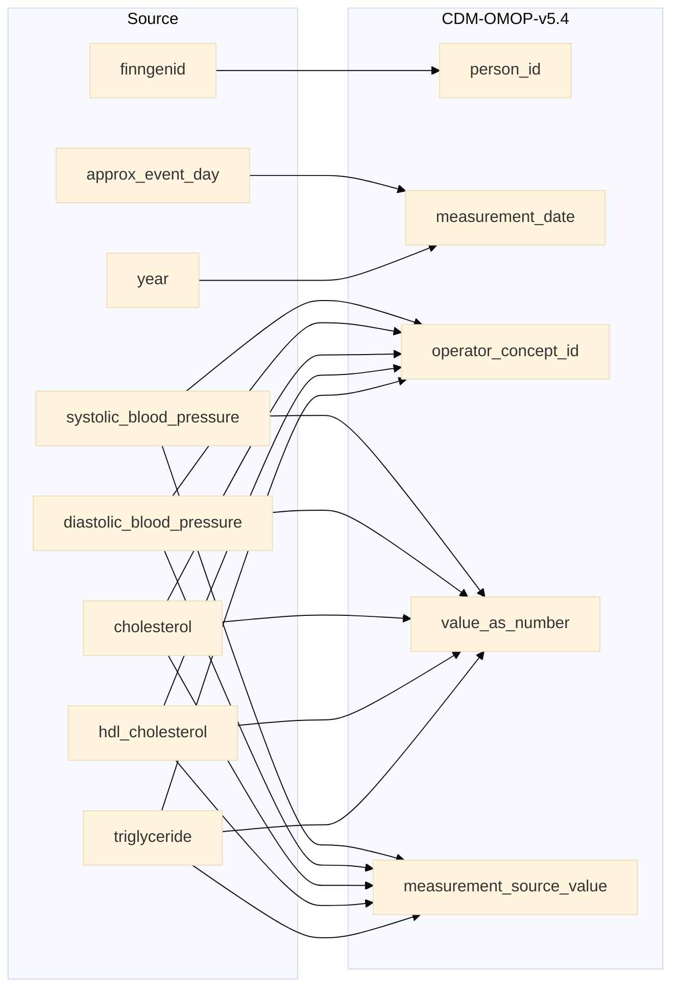

## kidney to measurement

| Destination Field | Source field | Logic | Comment field |
| --- | --- | --- | --- |
| measurement_id |  | Incremental integer. Unique value per each row measurement + 116000000000 (offset) | Generated |
| person_id | finngenid | `person_id` from person table where `person_source_value` equals `finngenid` |   Calculated |
| measurement_concept_id |  | `concept_id_2` from concept_relationship table where `concept_id_1` equals `measurement_source_concept_id` and `relationship_id` equals "Maps to" and `domain_id` is "Measurement" | Calculated   NOTE: 0 when `measurement_source_concept_id` is NULL  |
| measurement_date | approx_event_day year | `approx_visit_date` is directly taken from `approx_event_day` when not NULL   when NULL then end date of the `year` will be used. Ex: If `year` is 2019 then 2019-12-31 will be the `measurement_date` | Calculated |
| measurement_datetime |  | Calculated from  `measurement_date` with time 00:00:0000 | Calculated |
| measurement_time |  | Set 00:00:0000 for all | Calculated |
| measurement_type_concept_id |  | Set 32879 - 'Registry' for all | Calculated |
| operator_concept_id | systolic_blood_pressure diastolic_blood_pressure cholesterol hdl_cholesterol triglyceride | `concept_id` from concept table where `operator_vale` equals `concept_name` and  `domain_id` equals "Meas Value Operator". 0 if standard concept_id is not found. | Calculated |
| value_as_number | systolic_blood_pressure diastolic_blood_pressure cholesterol hdl_cholesterol triglyceride | Copied directly from the columns. | Copied |
| value_as_concept_id |  | Set 0 for all | Info not available |
| unit_concept_id |  | `concept_id_2` from concept_relationship table where `concept_id_1` equals `unit_source_concept_id` and `relationship_id` equals "Maps to" and  `domain_id` equals "Unit". 0 if standard concept_id is not found.  | Calculated |
| range_low |  | Set NULL for all | Info not available |
| range_high |  | Set NULL for all | Info not available |
| provider_id |  | `provider_id` for mapped `visit_occurrence_id` from visit_occurrence table. | Calculated |
| visit_occurrence_id |  | Link to correspondent `visit_occurrence_id` from visit_occurrence table where `visit_source_value` equals "SOURCE=`source`;INDEX=". | Calculated |
| visit_detail_id |  | Set NULL for all | Info not available |
| measurement_source_value | systolic_blood_pressure diastolic_blood_pressure cholesterol hdl_cholesterol triglyceride | `code` from fg_codes_info where `source` IN ("SYSTOLIC_BLOOD_PRESSURE", "DIASTOLIC_BLOOD_PRESSURE", "CHOLESTEROL", "HDL_CHOLESTEROL", "TRIGLYCERIDE") | Calculated |
| measurement_source_concept_id |  | `omop_source_concept_id` from fg_codes_info where `source` IN ("SYSTOLIC_BLOOD_PRESSURE", "DIASTOLIC_BLOOD_PRESSURE", "CHOLESTEROL", "HDL_CHOLESTEROL", "TRIGLYCERIDE")   ELSE 0 | Calculated |
| unit_source_value |  | "mmhg" for SYSTOLIC_BLOOD_PRESSURE and DIASTOLIC_BLOOD_PRESSURE   "mmol/l" for CHOLESTEROL, HDL_CHOLESTEROL and TRIGLYCERIDE | Calculated |
| unit_source_concept_id |  | `omop_concept_id` from fg_codes_info where `vocabulary_id` IN ("UNITfi") and `unit_source_value` equals `code`   ELSE 0 | Calculated |
| value_source_value |  | Set NULL for all | Info not available |
| measurement_event_id |  | Set NULL for all | Info not available |
| meas_event_field_concept_id |  | Set 0 for all | Info not available |

