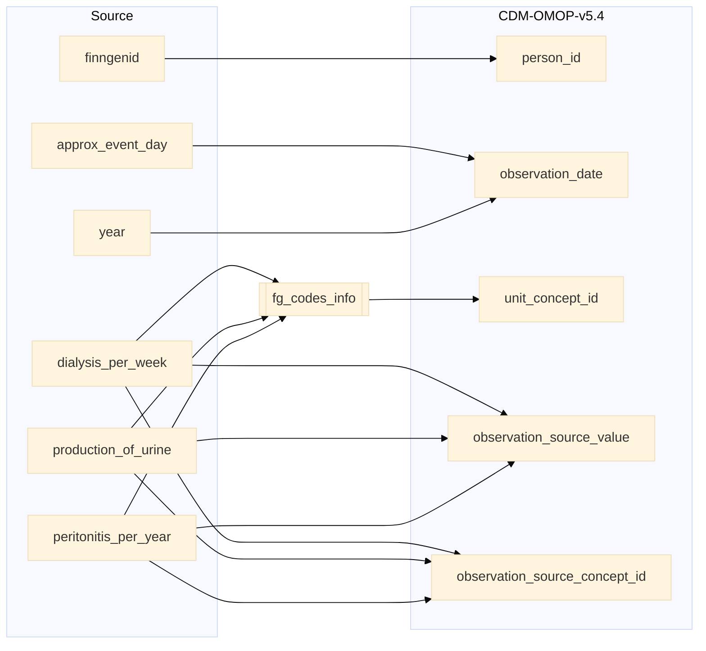

## kidney to observation

| Destination Field | Source field | Logic | Comment field |
| --- | --- | --- | --- |
| observation_id |  | Incremental integer. Unique value per each row observation + 115000000000 (offset). | Generated |
| person_id | finngenid | `person_id` from person table where `person_source_value` equals `finngenid` |   Calculated |
| observation_concept_id |  | `concept_id_2` from concept_relationship table where `concept_id_1` equals `observation_source_concept_id` and `relationship_id` equals "Maps to" and `domain_id` is "Observation" | Calculated   NOTE: 0 when `observation_source_concept_id` is NULL |
| observation_date | approx_event_day year | `approx_visit_date` is directly taken from `approx_event_day` when not NULL   when NULL then end date of the `year` will be used. Ex: If `year` is 2019 then 2019-12-31 will be the `observation_date` | Calculated |
| observation_datetime |  | Calculated from  `observation_date` with time 00:00:0000 | Calculated |
| observation_type_concept_id |  | Set 32879 - 'Registry' for all | Calculated |
| value_as_number |  | Set NULL for all | Info not available |
| value_as_string |  | Set NULL for all | Info not available |
| value_as_concept_id |  | Set 0 for all | Info not available |
| qualifier_concept_id |  | Set 0 for all | Info not available |
| unit_concept_id | dialysis_per_week production_of_urine peritonitis_per_year | `concept_id_2` from concept_relationship table where `concept_id_1` equals fg_codes_info `omop_concept_id` and `relationship_id` equals "Maps to" and  concept `domain_id` equals "Unit". 0 if standard concept_id is not found. | Calculated |
| provider_id |  | `provider_id` for mapped `visit_occurrence_id` from visit_occurrence table. | Calculated |
| visit_occurrence_id | | Link to correspondent `visit_occurrence_id` from visit_occurrence table where `visit_source_value` equals "SOURCE=`source`;INDEX=". | Calculated |
| visit_detail_id |  | Set NULL for all | Info not available |
| observation_source_value | dialysis_per_week production_of_urine peritonitis_per_year | `code` from fg_codes_info where `source` IN ("DIALYSIS_PER_WEEK", "PRODUCTION_OF_URINE", "PERITONITIS_PER_YEAR") | Calculated |
| observation_source_concept_id | dialysis_per_week production_of_urine peritonitis_per_year | `omop_source_concept_id` from fg_codes_info where `source` IN ("DIALYSIS_PER_WEEK", "PRODUCTION_OF_URINE", "PERITONITIS_PER_YEAR") | Calculated |
| unit_source_value |  | "ml" for production_of_urine   ELSE NULL | Calculated |
| qualifier_source_value |  | Set NULL for all | Info not available |
| value_source_value |  | Set NULL for all | Info not available |
| observation_event_id |  | Set NULL for all | Info not available |
| obs_event_field_concept_id |  | Set 0 for all | Info not available |

