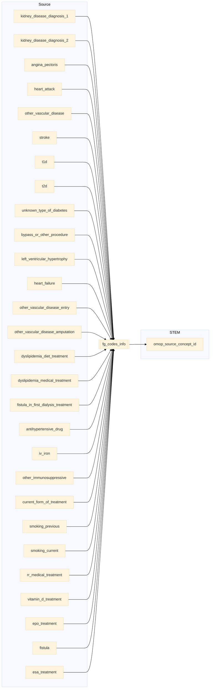

## kidney to stem

| Destination Field | Source field | Logic | Comment field |
| --- | --- | --- | --- |
| finngenid | finngenid | Copied as it is | Copied |
| source |  |  "KIDNEY" for kidney_disease_diagnosis_1 kidney_disease_diagnosis_2  ELSE column name is the `source`  | Calculated |
| approx_event_day | | Directly taken from `approx_event_day` when not NULL   when NULL then end date of the `year` will be used. Ex: If `year` is 2019 then 2019-12-31 will be the `approx_event_day` | Calculated |
| code1 | kidney_disease_diagnosis_1 kidney_disease_diagnosis_2 angina_pectoris heart_attack other_vascular_disease stroke t1d t2d unknown_type_of_diabetes bypass_or_other_procedure left_ventricular_hypertrophy heart_failure other_vascular_disease_entry other_vascular_disease_amputation dyslipidemia_diet_treatment dyslipidemia_medical_treatment fistula_in_first_dialysis_treatment antihypertensive_drug iv_iron other_immunosuppressive current_form_of_treatment smoking_previous smoking_current rr_medical_treatment vitamin_d_treatment epo_treatment fistula esa_treatment | For `kidney_disease_diagnosis_1` and `kidney_disease_diagnosis_2` there are combination codes and the first part is copied into `code1` after splitting by "*"  | Copied   NOTE: `kidney` table is a wide format (one column per diagnose). It is transformed to long format when converted to the `stem` table (one row per not null diagnose)   |
| code2 | kidney_disease_diagnosis_1 kidney_disease_diagnosis_2 | The second component of split by "*" is copied to `code2` | Copied |
| code3 | | Set NULL for all | Info not available   |
| code4 | | Set NULL for all | Info not available   |
| category |  | Set NULL for all | Info not available |
| index |  | Empty string | Calculated |
| code |  |`code` from fg_codes_info  | Calculated|
| vocabulary_id |  |  If `code1` starts with 0-9 then `vocabulary_id` is "ICD9fi".  ELSE `vocabulary_id` is "ICD10fi". | Calculated |
| omop_source_concept_id | | For `source` = "KIDNEY":  `omop_concept_id` from fg_codes_info where  `SOURCE`=`SOURCE` and  `code1`=`fg_code1` and  `code2`=`fg_code2` and  `code3`=`fg_code3` For rest: `omop_concept_id` from fg_codes_info where  `vocabulary_id`=`vocabulary_id` and  `code1`=`fg_code1` and  `code2`=`fg_code2` and  `code3`=`fg_code3` | Calculated |
| default_domain |  | Default domain is "condition" | Calculated |
