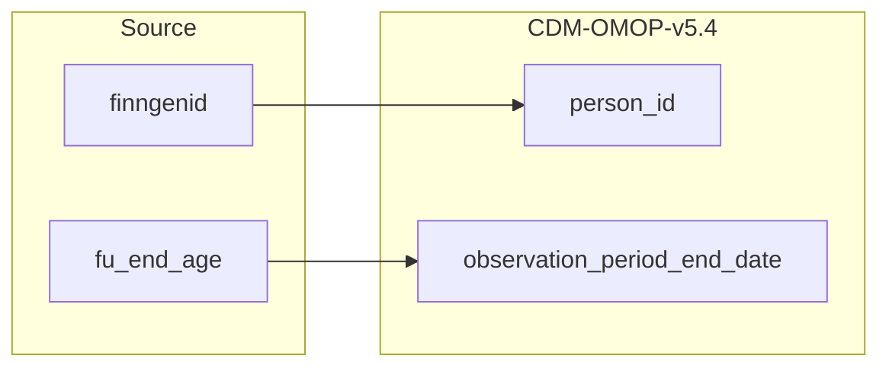

## Table name: observation_period

### Reading from finngenid_info

| Destination Field | Source field | Logic | Comment field |
| --- | --- | --- | --- |
| observation_period_id |  |  | Generated:  Incremental integer. Unique value per obsevation_period.   NOTE: at the moment there is only one observation period per person. |
| person_id | finngenid |  | Calculated:  cdm.person.person_id where cdm.person.person_source_value is source.finngenid_info.finngenid |
| observation_period_start_date |  |  | Calculated:   If cdm.person.birth_datetime < 1953, then 1953-01-01  if not  cdm.person.birth_datetime |
| observation_period_end_date | fu_end_age |  | Calculated:   if fu_end_age is not null then cdm.person.birthdate+fu_end_age  otherwise 2022-12-31 |
| period_type_concept_id |  |  | Calculated:   Set for all 32879 - Registry |

