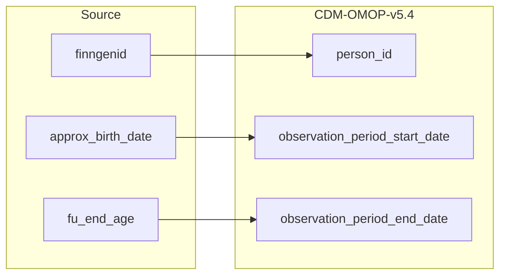

## Table name: observation_period

### Reading from finngenid_info

| Destination Field | Source field | Logic | Comment field |
| --- | --- | --- | --- |
| observation_period_id |   | Incremental integer.   Unique `obsevation_period` per each `finngenid`|  Generated   NOTE: at the moment there is only one observation period per person.  |
| person_id | finngenid | `person_id` from person table where `person.person_source_value` is `finngenid` |   Calculated|
| observation_period_start_date | approx_birth_date  | Copied from `approx_birth_date`   Except if `approx_birth_date` is before the start of the first registry (1953-01-01) it is set to 1953-01-01  | Calculated|
| observation_period_end_date | fu_end_age | Copied from `fu_end_age`   Except if `fu_end_age` is before the start of the first registry (2023-01-15) it is set to 2023-01-15 | Calculated|
| period_type_concept_id |   | Set 32879  - 'Registry' for all | Calculated| 

