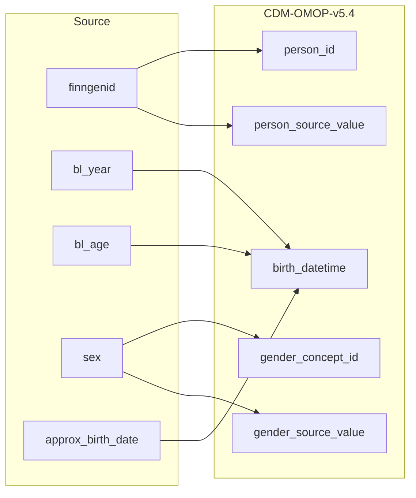

## Table name: person

### Reading from finngenid_info

| Destination Field | Source field | Logic | Comment field |
| --- | --- | --- | --- |
| person_id | finngenid | logic in arrow | coment in arrow Generated:  Incremental integer.   Unique person_id per each source.finngenid |
| gender_concept_id | sex |  | Calculated:  when source.finngenid_info.sex is 'male' then 8507  when source.finngenid_info.sex is 'female' then 8532  other wise 0 |
| year_of_birth |  |  | Calculated:  calculate from cdm.person.birth_datetime |
| month_of_birth |  |  | Calculated:  calculate from cdm. person.birth_datetime |
| day_of_birth |  |  | Calculated:  calculate from cdm.person.birth_datetime |
| birth_datetime | approx_birth_date bl_year bl_age |  | Calculated:  If source.finngenid_info.approx_birth_date is null then person.birth_datetime is calculated using source.finngenid_info.bl_year and source.finngenid_info.bl_age by substracting age from year  else source.finngenid_info.approx_birth_date |
| race_concept_id |  |  | Info not available:  Set 0 for all. |
| ethnicity_concept_id |  |  | Info not available:  Set 0 for all. |
| location_id |  |  | Info potentially available:  Possibly in source.finngenid_info.regionofbirth.   at the moment 0. |
| provider_id |  |  | Info not available:  Set 0 for all. |
| care_site_id |  |  | Info not available:  Set 0 for all. |
| person_source_value | finngenid |  | Calculated:  as it appears in source.finngenid_info.finngenid |
| gender_source_value | sex |  | Calculated:  as it appears in source.finngenid_info.sex |
| gender_source_concept_id |  |  | Info not available:  Set 0 for all. |
| race_source_value |  |  | Info not available:  Set NULL for all. |
| race_source_concept_id |  |  | Info not available:  Set 0 for all. |
| ethnicity_source_value |  |  | Info not available:  Set NULL for all. |
| ethnicity_source_concept_id |  |  | Info not available:  Set 0 for all. |

