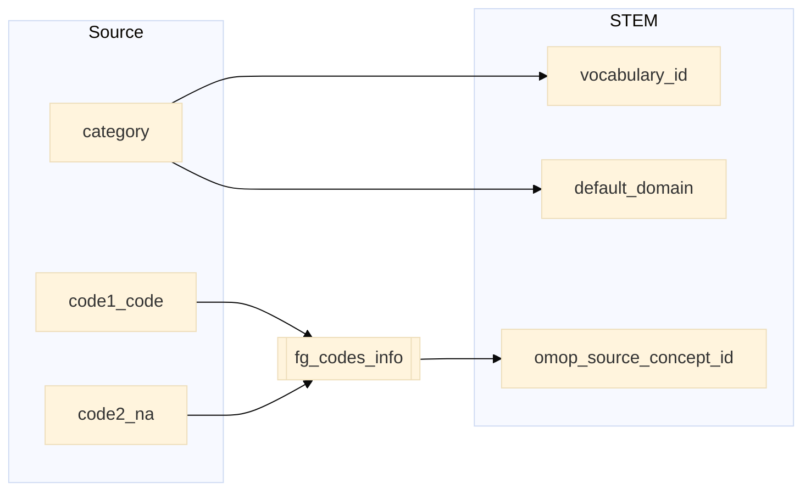

## prim_out to stem

| Destination Field | Source field | Logic | Comment field |
| --- | --- | --- | --- |
| finngenid | finngenid | Copied as it is | Copied |
| source | source |  Copied as it is | Copied |
| approx_event_day | approx_event_day | Copied as it is | Copied |
| code1 | code1_icd_symptom_operation_code | Copied as it is | Copied |
| code2 | code2_na | Copied as it is | Copied |
| code3 | | Set NULL for all | Info not available   |
| code4 | | Set NULL for all | Info not available   |
| category | category | Copied as it is | Copied |
| index | index | Copied as it is | Copied |
| code |  |`code` from fg_codes_info where `vocabulary_id`=`vocabulary_id` `code1`=`fg_code1` and `code2`=`fg_code2` | Calculated|
| vocabulary_id | category |  If `category` starts with "ICD" and `icdver` equals "10" then `vocabulary_id` is "ICD10fi".   If `category` starts with "MOP" then `vocabulary_id` is "NCSPfi".   If `category` starts with "ICP" then `vocabulary_id` is "ICPC".    If `category` starts with "OP" then `vocabulary_id` is "SPAT". | Calculated |
| omop_source_concept_id | | `omop_concept_id` from fg_codes_info where `vocabulary_id`=`vocabulary_id` and `code1`=`fg_code1` and `code2`=`fg_code2` | Calculated|
| default_domain | category | If `category` starts with  "OP" or "MOP" then `default_domain` is "procedure"   otherwise is "condition"| Calculated |
