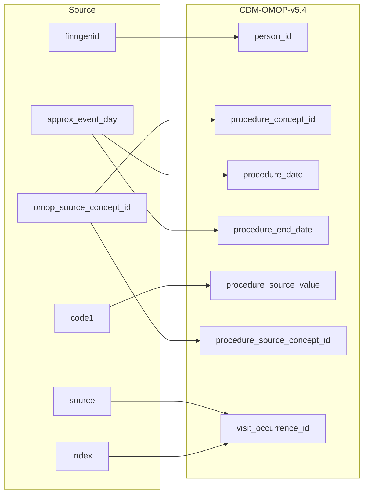

## Table name: procedure_occurrence

### Reading from stem_table

| Destination Field | Source field | Logic | Comment field |
| --- | --- | --- | --- |
| procedure_occurrence_id |  |  | Generated:   Incremental integer.   Unique value per each row procedure_occurence. |
| person_id | finngenid |  | Calculated:  person.person_id where person.person_source_value is stem.finngenid |
| procedure_concept_id | omop_source_concept_id |  | Calculated:  From joining stem.omop_source_concept_id to cdm.concept_relationship.concept_id_2 "Maps to" concept_id for all events where standard code domain is procedure or (when standard code domain is NULL and stem.default_domain LIKE procedure).   0 if not standard concept_id is found. Note: If more than one standard concept_id maps to the non-standard one row is added per  standard concept_id |
| procedure_date | approx_event_day |  | Calculated:  Based on APPROX_EVENT_DATE |
| procedure_datetime |  |  | Calculated:  procedure_occurence.procedure_date with time 00:00:0000 |
| procedure_end_date | approx_event_day |  | Calculated:  Same as on procedure_occurence.proecdure_date |
| procedure_end_datetime |  |  | Calculated:  procedure_occurence.procedure_end_date with time 00:00:0000 |
| procedure_type_concept_id |  |  | Calculated:  Set 32879-Registry for all |
| modifier_concept_id |  |  | Set 0 for now.   Info potentially available: Perhaps the some nomesco codes should be mapped to modifier vocabulary and used in here.   To discuse with FinOMOP. |
| quantity |  |  | Calculated:   Set 1 for all |
| provider_id |  |  | Calculated:   Same as parent visit_occurence.provider_id |
| visit_occurrence_id | source index |  | Calculated:   Link to correspondent visit_occurence.visit_occurrence_id calulated from stem.source+stem.index. |
| visit_detail_id |  |  | Info not available:  Set NULL |
| procedure_source_value | code1 |  | Calculated:   Copy as it is in stem.code1 |
| procedure_source_concept_id | omop_source_concept_id |  | Calculated:  If stem.omop_source_concept_id is not null then stem.omop_source_concept_id  Else 0 |
| modifier_source_value |  |  | Info not available:  Set NULL for all |

