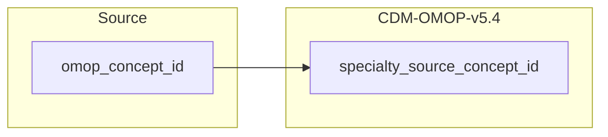

## Table name: provider

### Reading from fg_codes_info

| Destination Field | Source field | Logic | Comment field |
| --- | --- | --- | --- |
| provider_id |  | Incremental integer.  Unique value per code | Calculated |
| provider_name | name_en | Copied as it is | Copied |
| npi |  | Set NULL for all | Info not available |
| dea |  | Set NULL for all | Info not available |
| specialty_concept_id |  | `concept_id_2` from concept_relationship table where `concept_id_1` equals `specialty_source_concept_id` and `relationship_id` equals "Maps to" | Calculated |
| care_site_id |  | Set NULL for all | Info not available |
| year_of_birth |  | Set NULL for all | Info not available |
| gender_concept_id |  | Set 0 for all | Info not available |
| provider_source_value |  | Set NULL for all | Info not available |
| specialty_source_value | code | Copied as it is | Copied |
| specialty_source_concept_id | omop_concept_id | `omop_concept_id` where `vocabulary_id` in ("MEDSPECfi","ProfessionalCode") | Calculated |
| gender_source_value |  | Set NULL for all | Info not available |
| gender_source_concept_id |  | Set 0 for all | Info not available |