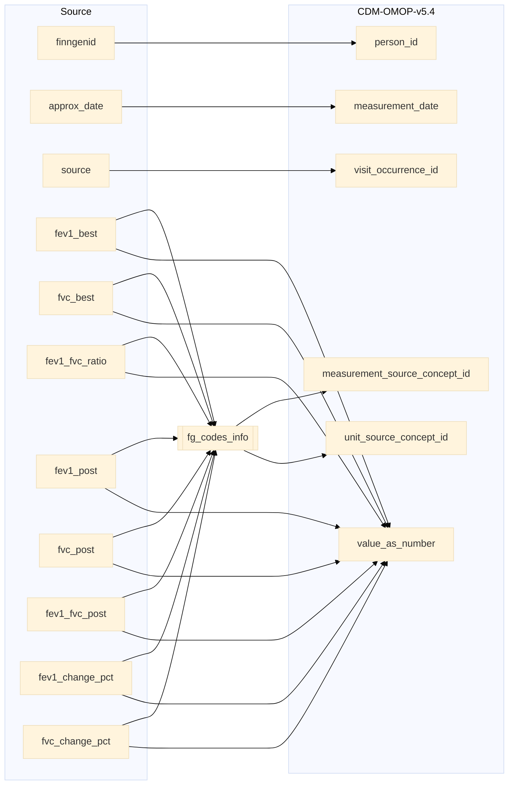

## spirometry to measurement

| Destination Field | Source field | Logic | Comment field |
| --- | --- | --- | --- |
| measurement_id |  | Incremental integer. Unique value per each row measurement + 121000000000 (offset) | Generated |
| person_id | finngenid | `person_id` from person table where `person_source_value` equals `finngenid` |   Calculated |
| measurement_concept_id |  | `concept_id_2` from concept_relationship table where `concept_id_1` equals `measurement_source_concept_id` and `relationship_id` equals "Maps to" and `domain_id` is "Measurement" | Calculated   NOTE: 0 when `measurement_source_concept_id` is NULL  |
| measurement_date | approx_date | copied from `approx_date` for all | Copied |
| measurement_datetime |  | add 00:00:00 to `measurement_date`  | Calculated |
| measurement_time |  | extract time from `measurement_datetime` for all | Calculated |
| measurement_type_concept_id |  | Set 32879 - 'Registry' for all | Calculated |
| operator_concept_id |  | Set 0 for all | Calculated |
| value_as_number | fev1_best fvc_best fev1_fvc_ratio fev1_post fvc_post fev1_fvc_post fev1_change_pct fvc_change_pct | Copied directly from variables| Copied   NOTE: `value_as_number` can be NULL |
| value_as_concept_id |  | Set 0 for all | Info not available |
| unit_concept_id |  | `concept_id_2` from concept_relationship table where `concept_id_1` equals `unit_source_concept_id` and `relationship_id` equals "Maps to" and  `domain_id` equals "Unit". 0 if standard concept_id is not found.  | Calculated |
| range_low |  | Set NULL for all | Info not available |
| range_high |  | Set NULL for all | Info not available |
| provider_id |  | `provider_id` for mapped `visit_occurrence_id` from visit_occurrence table. | Calculated |
| visit_occurrence_id | source | Link to correspondent `visit_occurrence_id` from visit_occurrence table where `visit_source_value` equals "SOURCE=`source`;INDEX=". | Calculated |
| visit_detail_id |  | Set NULL for all | Info not available |
| measurement_source_value | fev1_best fvc_best fev1_fvc_ratio fev1_post fvc_post fev1_fvc_post fev1_change_pct fvc_change_pct | Names of the variables as it is | Copied |
| measurement_source_concept_id | fev1_best fvc_best fev1_fvc_ratio fev1_post fvc_post fev1_fvc_post fev1_change_pct fvc_change_pct | `omop_concept_id` from fg_codes_info where `vocabulary_id` IN ("FGVisitType") and `measurement_source_value` equals `code`   ELSE 0 | Calculated |
| unit_source_value |  | Set as `l` for fev1_best, fev1_post, fvc_best and fvc_post. Rest is set to NULL | Calculated |
| unit_source_concept_id |  | `omop_concept_id` from fg_codes_info where `vocabulary_id` IN ("UNITfi") and `unit_source_value` equals `code`   ELSE 0 | Calculated |
| value_source_value |  | Set NULL for all | Info not available |
| measurement_event_id |  | Set NULL for all | Info not available |
| meas_event_field_concept_id |  | Set 0 for all | Info not available |

