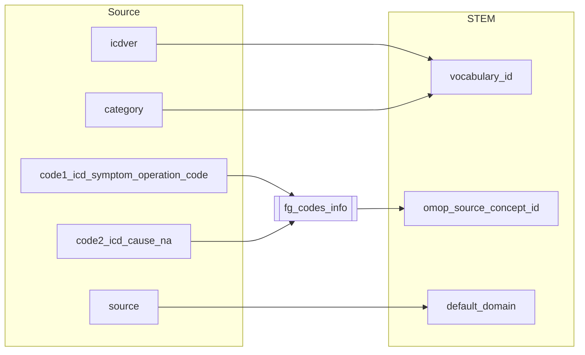

## Table name: stem_table

### Reading from hilmo

| Destination Field | Source field | Logic | Comment field |
| --- | --- | --- | --- |
| finngenid | finngenid | Copied as it is | Copied |
| source | source |  Copied as it is | Copied |
| approx_event_day | Copied as it is | Copied |
| code1 | code1_icd_symptom_operation_code | Copied as it is | Copied |
| code2 | code2_icd_cause_na | Copied as it is | Copied |
| code3 | | Set NULL for all | Info not available   |
| code4 | | Set NULL for all | Info not available   |
| category | category | Copied as it is | Copied |
| index | index | | Copied as it is | Copied |
| code |  |`code` from fg_codes_info where `vocabulary_id`=`vocabulary_id` `code1`=`fg_code1` and `code2`=`fg_code2` | Calcualted|
| vocabulary_id | category icdver |  If `category` starts with "ICD" and `icdver` equals "10" then `vocabulary_id` is "ICD10fi"   If `category` starts with "ICD" and `icdver` equals "9" then `vocabulary_id` is "ICD9fi"   If `category` starts with "ICD" and `icdver` equals "8" then `vocabulary_id` is "ICD8fi"   If `category` starts with "NOM" or "MOP" then `vocabulary_id` is "NCSPfi"   If `category` starts with "FHL" then `vocabulary_id` is "FHL"    If `category` starts with "HPO" then `vocabulary_id` is "HPO"   If `category` starts with "HPN" then `vocabulary_id` is "HPN" | Calculated |
| omop_source_concept_id | | `omop_concept_id` from fg_codes_info where `vocabulary_id`=`vocabulary_id` `code1`=`fg_code1` and `code2`=`fg_code2` | Calculated|
| default_domain | source | If `source` equals "OPER_IN" or "OPER_OUT" then `default_domain` is "procedure"   otherwise is "condition"| Calculated |

