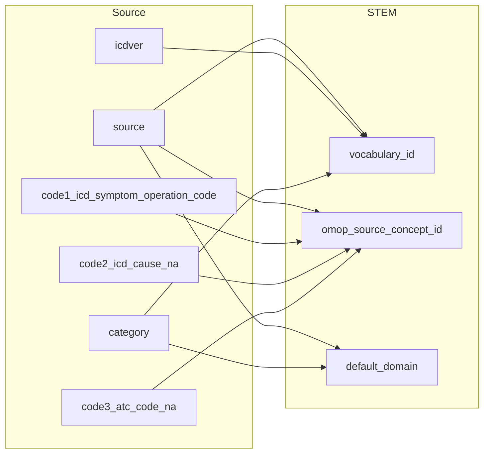
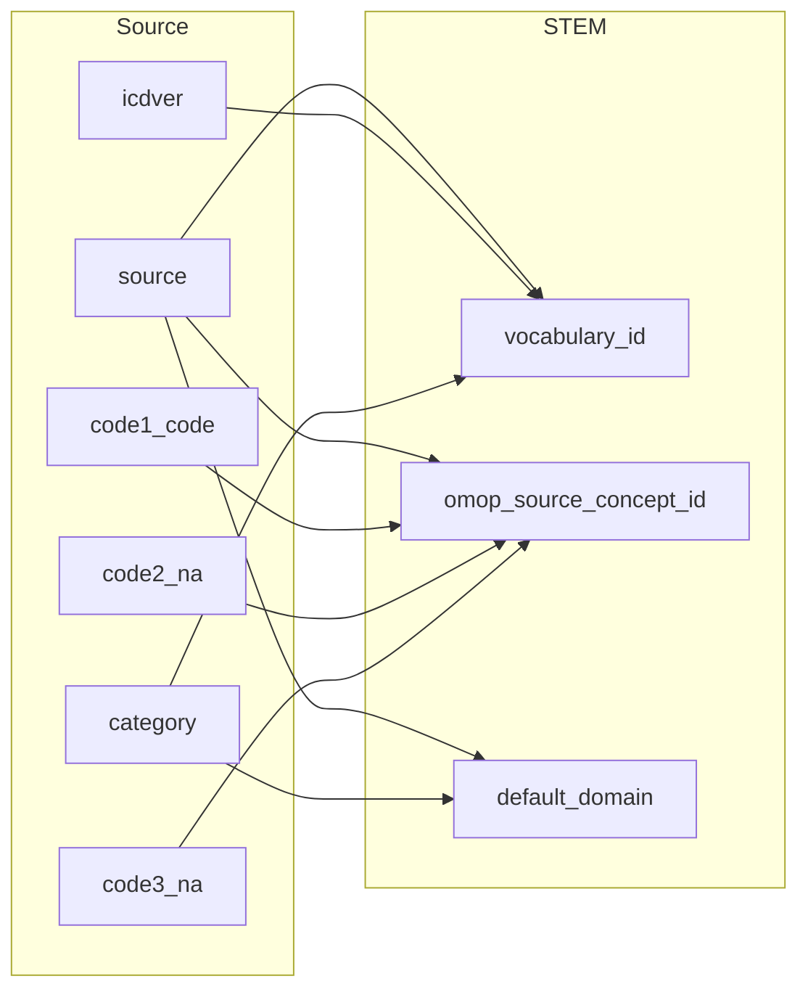
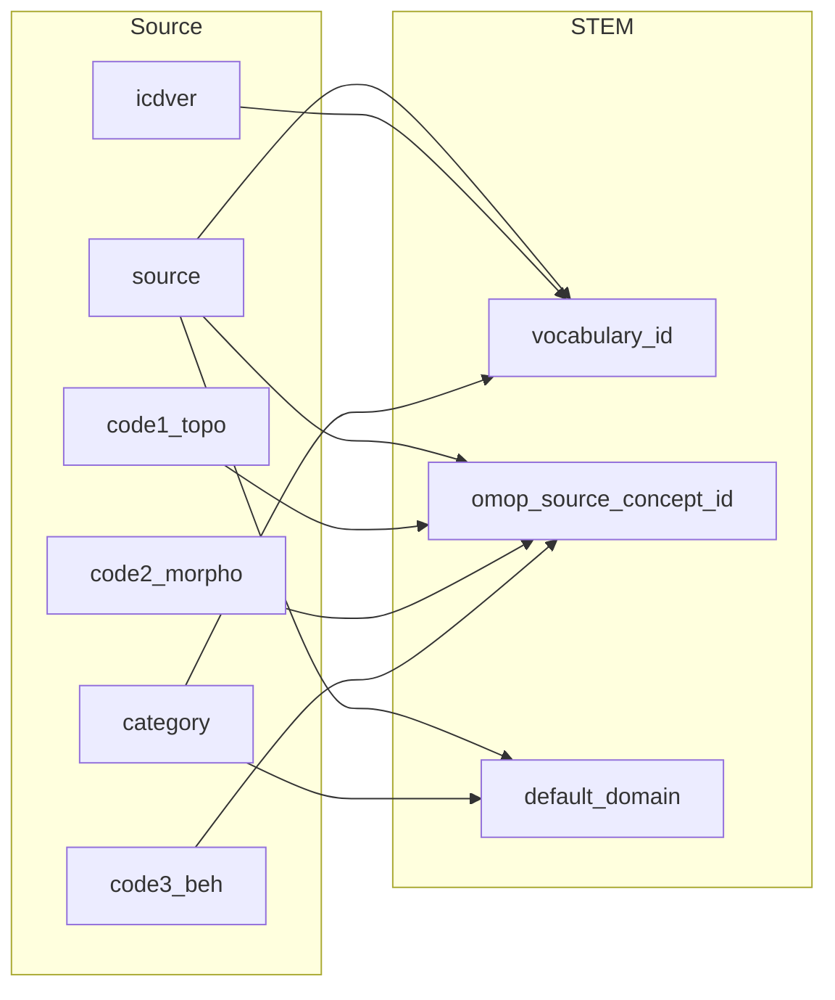
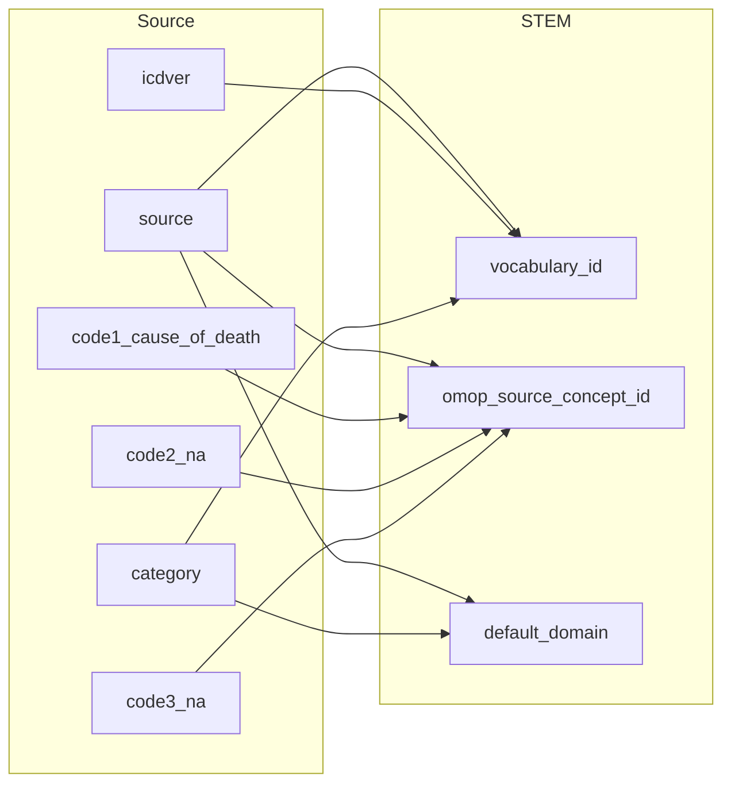

## Table name: stem_table

### Reading from hilmo

| Destination Field | Source field | Logic | Comment field |
| --- | --- | --- | --- |
| finngenid |  |  | source.finngenid |
| source |  |  | source.source |
| approx_event_day |  |  | source.approx_event_day |
| code1 |  |  | source.code1_icd_symptom_operation_code |
| code2 |  |  | source.code2_icd_cause_na |
| code3 |  |  | source.code3_atc_code_na |
| code4 |  |  | source.code4_hospital_days_na |
| category |  |  | source.category |
| index |  |  | source.index |
| code |  |  | medical_codes.fg_codes_info.code |
| vocabulary_id | source icdver category |  | Calculated:   Configurable external parameters with default settings  ICD10fi_map_to = 'CODE1_CODE2' CANC_map_to = 'MORPO_BEH_TOPO' REIMB_map_to = 'REIMB' REIMB1_map_to = 'ICD'  Given external parameters with default settings then cdm.stem.vocabulary_id is determined based on source.source, source.icdver and source.category   |
| omop_source_concept_id | source code1_icd_symptom_operation_code code2_icd_cause_na code3_atc_code_na |  | Calculated: medical_codes.fg_codes_info.omop_source_concept_id is extracted when the following conditions are met   source.source = medical_codes.fg_codes_info.source AND   source.code1_icd_symptom_operation_code = medical_codes.fg_codes_info.fg_code1 AND   source.code2_icd_cause_na = medical_codes.fg_codes_info.fg_code2 AND   source.code3_atc_code_na = medical_codes.fg_codes_info.fg_code3  |
| default_domain | source category |  | Calculated:   If standard code domain is NOT NULL then cdm.concept.domain_id.  If no standard code map available then source.source in ("OPER_IN","OPER_OUT") will have procedure as default_domain.  If no standard code map available then source.source is "PRIM_OUT" and source.category contains ("OP","MOP") will have procedure as default_domain.  If no standard code domain exists then by default the domain is condition.  |

### Reading from prim_out

| Destination Field | Source field | Logic | Comment field |
| --- | --- | --- | --- |
| finngenid |  |  | source.finngenid |
| source |  |  | source.source |
| approx_event_day |  |  | source.approx_event_day |
| code1 |  |  | source.code1_code |
| code2 |  |  | source.code2_na |
| code3 |  |  | source.code3_na |
| code4 |  |  | source.code4_na |
| category |  |  | source.category |
| index |  |  | source.index |
| code |  |  | medical_codes.fg_codes_info.code |
| vocabulary_id | source icdver category |  | Calculated:   Configurable external parameters with default settings  ICD10fi_map_to = 'CODE1_CODE2' CANC_map_to = 'MORPO_BEH_TOPO' REIMB_map_to = 'REIMB' REIMB1_map_to = 'ICD'  Given external parameters with default settings then cdm.stem.vocabulary_id is determined based on source.source, source.icdver and source.category   |
| omop_source_concept_id | source code1_code code2_na code3_na |  | Calculated: medical_codes.fg_codes_info.omop_source_concept_id is extracted when the following conditions are met   source.source = medical_codes.fg_codes_info.source AND   source.code1_code = medical_codes.fg_codes_info.fg_code1 AND   source.code2_na = medical_codes.fg_codes_info.fg_code2 AND   source.code3_na = medical_codes.fg_codes_info.fg_code3  |
| default_domain | source category |  | Calculated:   If standard code domain is NOT NULL then cdm.concept.domain_id.  If no standard code map available then source.source in ("OPER_IN","OPER_OUT") will have procedure as default_domain.  If no standard code map available then source.source is "PRIM_OUT" and source.category contains ("OP","MOP") will have procedure as default_domain.  If no standard code domain exists then by default the domain is condition.  |

### Reading from reimb

| Destination Field | Source field | Logic | Comment field |
| --- | --- | --- | --- |
| finngenid |  |  | source.finngenid |
| source |  |  | source.source |
| approx_event_day |  |  | source.approx_event_day |
| code1 |  |  | source.code1_kela_disease |
| code2 |  |  | source.code2_icd |
| code3 |  |  | source.code3_na |
| code4 |  |  | source.code4_na |
| category |  |  | source.category |
| index |  |  | source.index |
| code |  |  | medical_codes.fg_codes_info.code |
| vocabulary_id | source icdver category |  | Calculated:   Configurable external parameters with default settings  ICD10fi_map_to = 'CODE1_CODE2' CANC_map_to = 'MORPO_BEH_TOPO' REIMB_map_to = 'REIMB' REIMB1_map_to = 'ICD'  Given external parameters with default settings then cdm.stem.vocabulary_id is determined based on source.source, source.icdver and source.category   |
| omop_source_concept_id | source code1_kela_disease code2_icd code3_na |  | Calculated: medical_codes.fg_codes_info.omop_source_concept_id is extracted when the following conditions are met   source.source = medical_codes.fg_codes_info.source AND   source.code1_kela_disease = medical_codes.fg_codes_info.fg_code1 AND   source.code2_icd = medical_codes.fg_codes_info.fg_code2 AND   source.code3_na = medical_codes.fg_codes_info.fg_code3  |
| default_domain | source category |  | Calculated:   If standard code domain is NOT NULL then cdm.concept.domain_id.  If no standard code map available then source.source in ("OPER_IN","OPER_OUT") will have procedure as default_domain.  If no standard code map available then source.source is "PRIM_OUT" and source.category contains ("OP","MOP") will have procedure as default_domain.  If no standard code domain exists then by default the domain is condition.  |

### Reading from canc

| Destination Field | Source field | Logic | Comment field |
| --- | --- | --- | --- |
| finngenid |  |  | source.finngenid |
| source |  |  | source.source |
| approx_event_day |  |  | source.approx_event_day |
| code1 |  |  | source.code1_topo |
| code2 |  |  | source.code2_morpho |
| code3 |  |  | source.code3_beh |
| code4 |  |  | source.code4_na |
| category |  |  | source.category |
| index |  |  | source.index |
| code |  |  | medical_codes.fg_codes_info.code |
| vocabulary_id | source icdver category |  | Calculated:   Configurable external parameters with default settings  ICD10fi_map_to = 'CODE1_CODE2' CANC_map_to = 'MORPO_BEH_TOPO' REIMB_map_to = 'REIMB' REIMB1_map_to = 'ICD'  Given external parameters with default settings then cdm.stem.vocabulary_id is determined based on source.source, source.icdver and source.category   |
| omop_source_concept_id | source code1_topo code2_morpho code3_beh |  | Calculated: medical_codes.fg_codes_info.omop_source_concept_id is extracted when the following conditions are met   source.source = medical_codes.fg_codes_info.source AND   source.code1_topo = medical_codes.fg_codes_info.fg_code1 AND   source.code2_morpho = medical_codes.fg_codes_info.fg_code2 AND   source.code3_beh = medical_codes.fg_codes_info.fg_code3  |
| default_domain | source category |  | Calculated:   If standard code domain is NOT NULL then cdm.concept.domain_id.  If no standard code map available then source.source in ("OPER_IN","OPER_OUT") will have procedure as default_domain.  If no standard code map available then source.source is "PRIM_OUT" and source.category contains ("OP","MOP") will have procedure as default_domain.  If no standard code domain exists then by default the domain is condition.  |

### Reading from death_register

| Destination Field | Source field | Logic | Comment field |
| --- | --- | --- | --- |
| finngenid |  |  | source.finngenid |
| source |  |  | source.source |
| approx_event_day |  |  | source.approx_event_day |
| code1 |  |  | source.code1_cause_of_death |
| code2 |  |  | source.code2_na |
| code3 |  |  | source.code3_na |
| code4 |  |  | source.code4_na |
| category |  |  | source.category |
| index |  |  | source.index |
| code |  |  | medical_codes.fg_codes_info.code |
| vocabulary_id | source icdver category |  | Calculated:   Configurable external parameters with default settings  ICD10fi_map_to = 'CODE1_CODE2' CANC_map_to = 'MORPO_BEH_TOPO' REIMB_map_to = 'REIMB' REIMB1_map_to = 'ICD'  Given external parameters with default settings then cdm.stem.vocabulary_id is determined based on source.source, source.icdver and source.category   |
| omop_source_concept_id | source code1_cause_of_death code2_na code3_na |  | Calculated: medical_codes.fg_codes_info.omop_source_concept_id is extracted when the following conditions are met   source.source = medical_codes.fg_codes_info.source AND   source.code1_cause_of_death = medical_codes.fg_codes_info.fg_code1 AND   source.code2_na = medical_codes.fg_codes_info.fg_code2 AND   source.code3_na = medical_codes.fg_codes_info.fg_code3  |
| default_domain | source category |  | Calculated:   If standard code domain is NOT NULL then cdm.concept.domain_id.  If no standard code map available then source.source in ("OPER_IN","OPER_OUT") will have procedure as default_domain.  If no standard code map available then source.source is "PRIM_OUT" and source.category contains ("OP","MOP") will have procedure as default_domain.  If no standard code domain exists then by default the domain is condition.  |