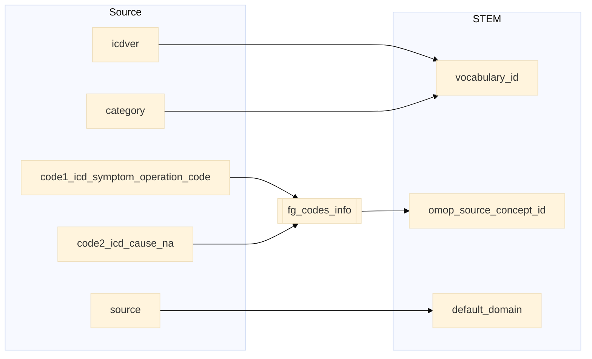
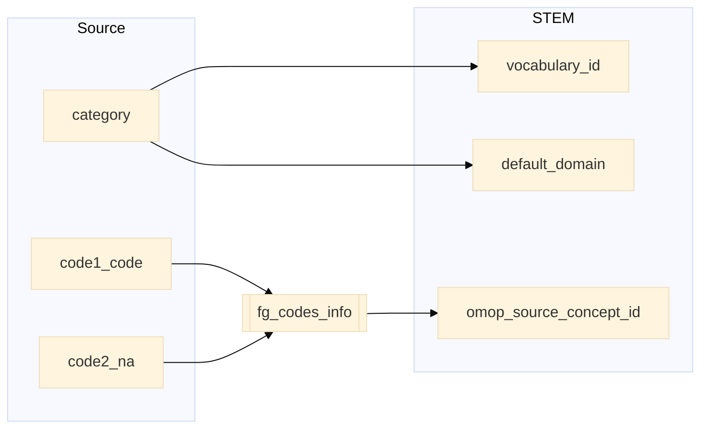
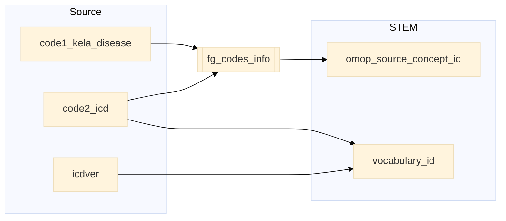
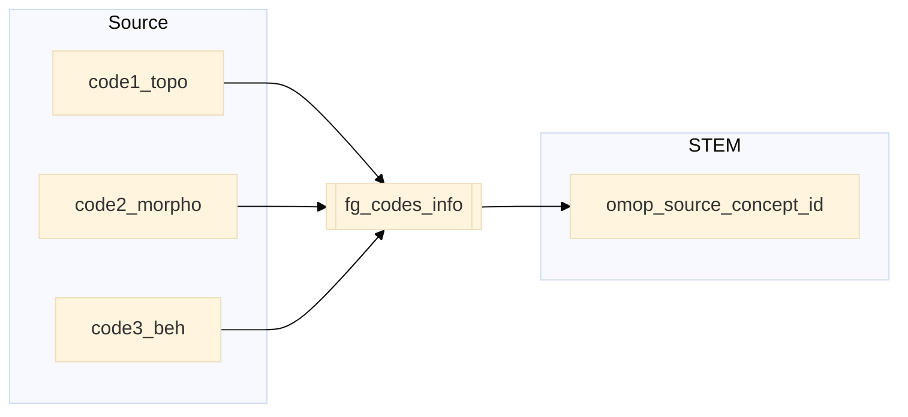
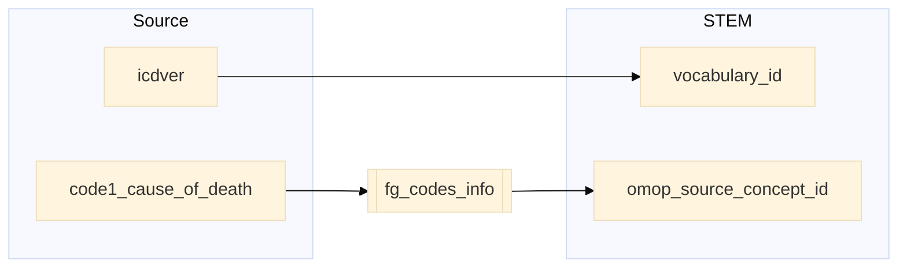

## Table name: stem_table

### Reading from hilmo

| Destination Field | Source field | Logic | Comment field |
| --- | --- | --- | --- |
| finngenid | finngenid | Copied as it is | Copied |
| source | source |  Copied as it is | Copied |
| approx_event_day | approx_event_day | Copied as it is | Copied |
| code1 | code1_icd_symptom_operation_code | Copied as it is | Copied |
| code2 | code2_icd_cause_na | Copied as it is | Copied |
| code3 | | Set NULL for all | Info not available   |
| code4 | code4_hospital_days_na| Copied as it is | Copied   |
| category | category | Copied as it is | Copied |
| index | index | Copied as it is | Copied |
| code |  |`code` from fg_codes_info where `vocabulary_id`=`vocabulary_id` `code1`=`fg_code1` and `code2`=`fg_code2` | Calculated|
| vocabulary_id | category icdver |  If `category` starts with "ICD" and `icdver` equals "10" then `vocabulary_id` is "ICD10fi".   If `category` starts with "ICD" and `icdver` equals "9" then `vocabulary_id` is "ICD9fi".   If `category` starts with "ICD" and `icdver` equals "8" then `vocabulary_id` is "ICD8fi".   If `category` starts with "NOM" or "MOP" then `vocabulary_id` is "NCSPfi".   If `category` starts with "FHL" then `vocabulary_id` is "FHL".    If `category` starts with "HPO" then `vocabulary_id` is "HPO".   If `category` starts with "HPN" then `vocabulary_id` is "HPN". | Calculated |
| omop_source_concept_id | | `omop_concept_id` from fg_codes_info where `vocabulary_id`=`vocabulary_id` and `code1`=`fg_code1` and `code2`=`fg_code2` | Calculated|
| default_domain | source | If `source` equals "OPER_IN" or "OPER_OUT" then `default_domain` is "procedure"   otherwise is "condition"| Calculated |

### Reading from prim_out

| Destination Field | Source field | Logic | Comment field |
| --- | --- | --- | --- |
| finngenid | finngenid | Copied as it is | Copied |
| source | source |  Copied as it is | Copied |
| approx_event_day | approx_event_day | Copied as it is | Copied |
| code1 | code1_icd_symptom_operation_code | Copied as it is | Copied |
| code2 | code2_na | Copied as it is | Copied |
| code3 | | Set NULL for all | Info not available   |
| code4 | | Set NULL for all | Info not available   |
| category | category | Copied as it is | Copied |
| index | index | Copied as it is | Copied |
| code |  |`code` from fg_codes_info where `vocabulary_id`=`vocabulary_id` `code1`=`fg_code1` and `code2`=`fg_code2` | Calculated|
| vocabulary_id | category |  If `category` starts with "ICD" and `icdver` equals "10" then `vocabulary_id` is "ICD10fi".   If `category` starts with "MOP" then `vocabulary_id` is "NCSPfi".   If `category` starts with "ICP" then `vocabulary_id` is "ICPC".    If `category` starts with "OP" then `vocabulary_id` is "SPAT". | Calculated |
| omop_source_concept_id | | `omop_concept_id` from fg_codes_info where `vocabulary_id`=`vocabulary_id` and `code1`=`fg_code1` and `code2`=`fg_code2` | Calculated|
| default_domain | category | If `category` starts with  "OP" or "MOP" then `default_domain` is "procedure"   otherwise is "condition"| Calculated |

### Reading from reimb

| Destination Field | Source field | Logic | Comment field |
| --- | --- | --- | --- |
| finngenid | finngenid | Copied as it is | Copied |
| source | source |  Copied as it is | Copied |
| approx_event_day | approx_event_day | Copied as it is | Copied |
| code1 | code1_kela_disease code2_icd | Default `code1_kela_disease` will be copied.  For all `code2_icd` not null will be copied as well in a new row. | Split into two rows |
| code2 |  | Set NULL for all | Info not available |
| code3 | | Set NULL for all | Info not available   |
| code4 | | Set NULL for all | Info not available   |
| category | category | Copied as it is | Copied |
| index | index | Copied as it is | Copied |
| code |  |`code` from fg_codes_info where `vocabulary_id`=`vocabulary_id` and  `code1`=`fg_code1` | Calculated|
| vocabulary_id | code2_icd icdver |  If `code2_icd` is NULL then `vocabulary_id` equals "REIMB"  If `code2_icd` is not NULL and `icdver` equals "10" then `vocabulary_id` is "ICD10fi".   If `code2_icd` is not NULL and `icdver` equals "9" then `vocabulary_id` is "ICD9fi".   If `code2_icd` is not NULL and `icdver` equals "8" then `vocabulary_id` is "ICD8fi". | Calculated |
| omop_source_concept_id | | `omop_concept_id` from fg_codes_info where `vocabulary_id`=`vocabulary_id` and `code1`=`fg_code1` | Calculated|
| default_domain |  | Default domain is "condition"| Calculated |

### Reading from canc

| Destination Field | Source field | Logic | Comment field |
| --- | --- | --- | --- |
| finngenid | finngenid | Copied as it is | Copied |
| source | source |  Copied as it is | Copied |
| approx_event_day | approx_event_day | Copied as it is | Copied |
| code1 | code1_topo | Copied as it is | Copied |
| code2 | code2_morpho | Copied as it is | Copied |
| code3 | code3_beh | Copied as it is | Copied |
| code4 | | Set NULL for all | Info not available   |
| category | category | Copied as it is | Copied |
| index | index | Copied as it is | Copied |
| code |  |`code` from fg_codes_info where `vocabulary_id`=`vocabulary_id` and `code1`=`fg_code1` and `code2`=`fg_code2` and `code3`=`fg_code3` | Calculated|
| vocabulary_id |  | `vocabulary_id` is "ICDO3" | Calculated |
| omop_source_concept_id | | `omop_concept_id` from fg_codes_info where `vocabulary_id`=`vocabulary_id` and `code1`=`fg_code1` and `code2`=`fg_code2` and `code3`=`fg_code3` | Calculated|
| default_domain |  | Default domain is "condition"| Calculated |

### Reading from death_register

| Destination Field | Source field | Logic | Comment field |
| --- | --- | --- | --- |
| finngenid | finngenid | Copied as it is | Copied |
| source | source |  Copied as it is | Copied |
| approx_event_day | approx_event_day | Copied as it is | Copied |
| code1 | code1_cause_of_death | Copied as it is | Copied |
| code2 |  | Set NULL for all | Info not available |
| code3 |  | Set NULL for all | Info not available |
| code4 |  | Set NULL for all | Info not available |
| category | category | Copied as it is | Copied |
| index | index | Copied as it is | Copied |
| code |  |`code` from fg_codes_info where `vocabulary_id`=`vocabulary_id` and `code1`=`fg_code1` | Calculated|
| vocabulary_id | icdver | If `icdver` equals "10" then `vocabulary_id` equals "ICD10fi".  If `icdver` equals "9" then `vocabulary_id` equals "ICD9fi".   If `icdver` equals "8" then `vocabulary_id` equals "ICD8fi". | Calculated |
| omop_source_concept_id | | `omop_concept_id` from fg_codes_info where `vocabulary_id`=`vocabulary_id` and `code1`=`fg_code1` | Calculated|
| default_domain |  | Default domain is "condition"| Calculated |
