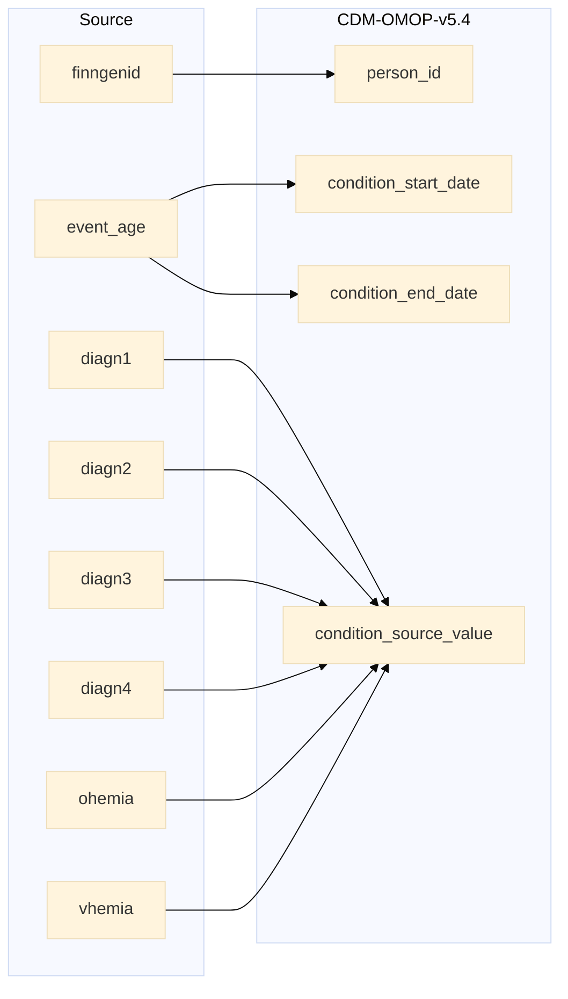

## vision to condition_occurrence

| Destination Field | Source field | Logic | Comment field |
| --- | --- | --- | --- |
| condition_occurrence_id |  | Incremental integer. Unique value per each row measurement + 114000000000 (offset) | Generated |
| person_id | finngenid | `person_id` from person table where `person_source_value` equals `finngenid` |   Calculated |
| condition_concept_id |  | `concept_id_2` from concept_relationship table where `concept_id_1` equals `condition_source_concept_id` and `relationship_id` equals "Maps to" and `domain_id` is "Condition" | Calculated   NOTE: 0 when `condition_source_concept_id` is NULL  |
| condition_start_date | event_age | `approx_visit_date` is calculated as by adding event_age to approx_birth_date from finngenid_info table. | Calculated |
| condition_start_datetime |   | Calculated from  `condition_start_date` with time 00:00:0000 | Calculated |
| condition_end_date | event_age | `approx_visit_date` is calculated as by adding event_age to approx_birth_date from finngenid_info table. | Calculated |
| condition_end_datetime |  | Calculated from  `condition_end_date` with time 00:00:0000 | Calculated |
| condition_type_concept_id |  |  Set 32879  - 'Registry' for all | Calculated |
| condition_status_concept_id |  |  Set 0  | Calculated |
| stop_reason |  | Set NULL for all | Info not available |
| provider_id |  | `provider_id` for mapped `visit_occurrence_id` from visit_occurrence table. | Calculated |
| visit_occurrence_id |  | Link to correspondent `visit_occurrence_id` from visit_occurrence table where `visit_source_value` equals "SOURCE=VISION;INDEX=". | Calculated |
| visit_detail_id |  | Set NULL for all | Info not available |
| condition_source_value | NEST(diagn1,..,diagn4) ohemia vhemia | String build as "CODE1=`code1`;CODE2=;CODE3="   `code1` is a temporary column constructed based on following conditions:  Each non-null value except 0544C code, from ICD9CM and ICD10 vocabulary, is taken as condition for a FINNGENID. All events with ohemia value 1 is code 5591009 from Nebraska Lexicon vocabulary. All events with vhemia value 1 is code 55634009 from Nebraska Lexicon vocabulary. | Calculated |
| condition_source_concept_id |  | `concept_id` from concept table where `code1` equals `concept_code` and `vocabulary_id` in ("ICD9CM", "ICD10", "Nebraska Lexicon")   ELSE 0 | Calculated |
| condition_status_source_value |  | Copy `category` as it is | Copied  |