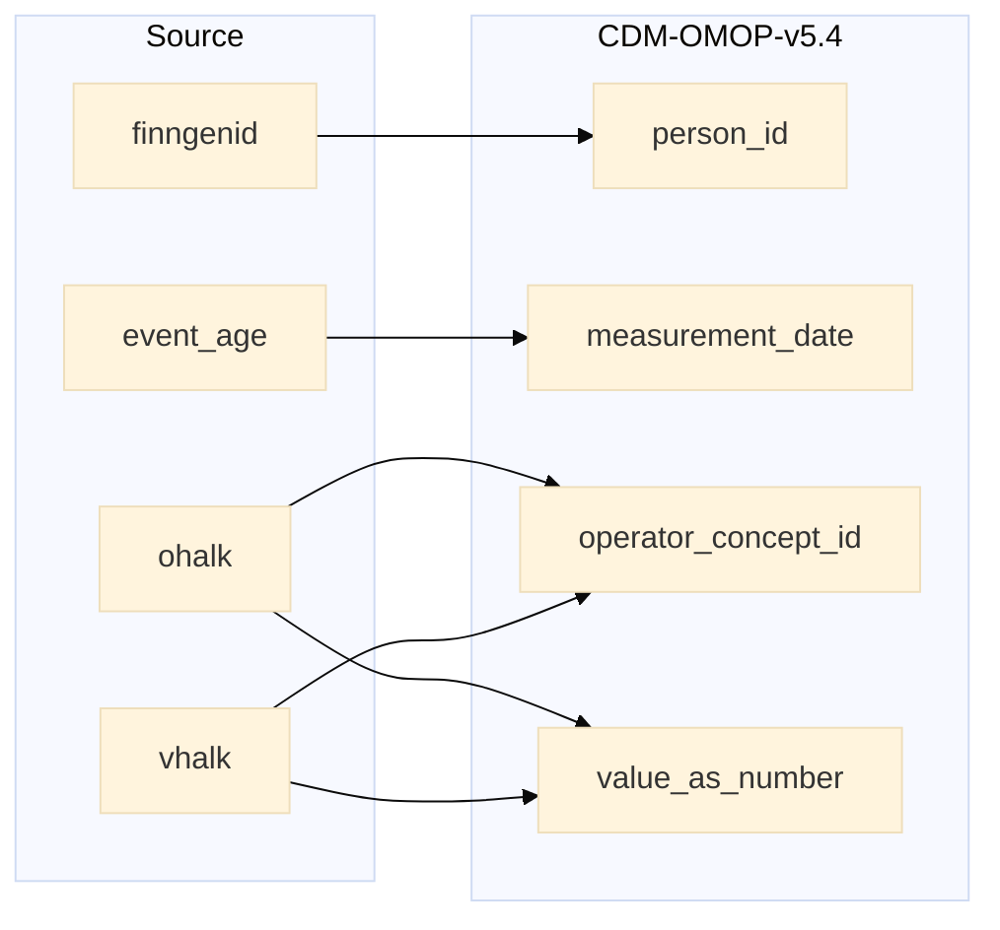

## vision to measurement

| Destination Field | Source field | Logic | Comment field |
| --- | --- | --- | --- |
| measurement_id |  | Incremental integer. Unique value per each row measurement + 111000000000 (offset) | Generated |
| person_id | finngenid | `person_id` from person table where `person_source_value` equals `finngenid` |   Calculated |
| measurement_concept_id |  | `concept_id_2` from concept_relationship table where `concept_id_1` equals `measurement_source_concept_id` and `relationship_id` equals "Maps to" and `domain_id` is "Measurement" | Calculated   NOTE: 0 when `measurement_source_concept_id` is NULL  |
| measurement_date | event_age | `approx_visit_date` is calculated as by adding event_age to approx_birth_date from finngenid_info table. | Calculated |
| measurement_datetime |  | Calculated from  `measurement_date` with time 00:00:0000 | Calculated |
| measurement_time |  | Set 00:00:0000 for all | Calculated |
| measurement_type_concept_id |  | Set 32879 - 'Registry' for all | Calculated |
| operator_concept_id | ohalk vhalk | `concept_id` from concept table where `operator_vale` equals `concept_name` and  `domain_id` equals "Meas Value Operator". 0 if standard concept_id is not found. `operator_value` is "=" for ohlak or vhalk equals 1,  "<=" for ohalk or vhalk in (2,3,4,5),  else ">" | Calculated |
| value_as_number | ohalk vhalk | `value_as_number` is  0 for ohlak or vhalk equals 1,  5 when ohalk or vhalk equals 2,  10 when ohalk or vhalk equals 3, 20 when ohalk or vhalk equals 4,   else 60 | Calculated |
| value_as_concept_id |  | Set 0 for all | Info not available |
| unit_concept_id |  | `concept_id_2` from concept_relationship table where `concept_id_1` equals `unit_source_concept_id` and `relationship_id` equals "Maps to" and  `domain_id` equals "Unit". 0 if standard concept_id is not found.  | Calculated |
| range_low |  | Set NULL for all | Info not available |
| range_high |  | Set NULL for all | Info not available |
| provider_id |  | `provider_id` for mapped `visit_occurrence_id` from visit_occurrence table. | Calculated |
| visit_occurrence_id |  | Link to correspondent `visit_occurrence_id` from visit_occurrence table where `visit_source_value` equals "SOURCE=VISION;INDEX=". | Calculated |
| visit_detail_id |  | Set NULL for all | Info not available |
| measurement_source_value |  | When ohalk is not null then 'VFDRE' as SOURCE  When weight is null then 'VFDLE' as SOURCE | Calculated |
| measurement_source_concept_id |  | `omop_source_concept_id` from fg_codes_info where `source` IN ("VFDRE", "VFDLE") and `vocabulary_id` equals "FGvisitType"   ELSE 0 | Calculated |
| unit_source_value |  | "degrees of arc" | Calculated |
| unit_source_concept_id |  | `concept_id` from concept table where `concept_name` equals "degrees of arc" and `vocabulary_id` equals "SNOMED" and `domain_id` equals "Unit"  ELSE 0 | Calculated |
| value_source_value |  | Set NULL for all | Info not available |
| measurement_event_id |  | Set NULL for all | Info not available |
| meas_event_field_concept_id |  | Set 0 for all | Info not available |

