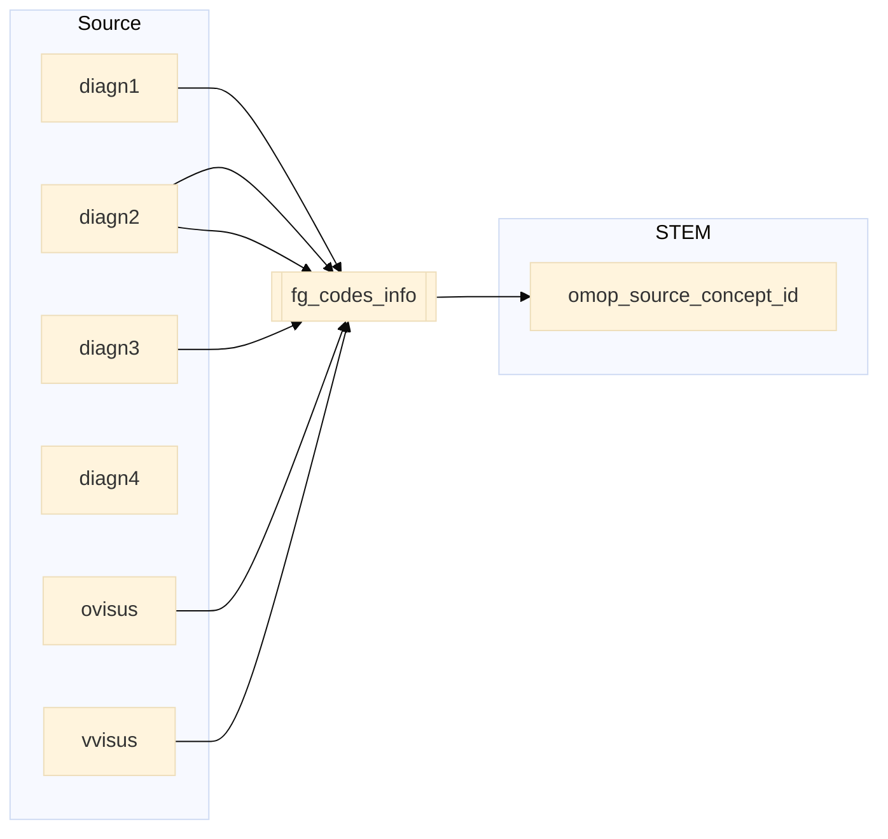

## vision to stem

| Destination Field | Source field | Logic | Comment field |
| --- | --- | --- | --- |
| finngenid | finngenid | Copied as it is | Copied |
| source |  |  "VISION" | Calculated |
| approx_event_day | event_age | `approx_visit_date` is calculated as by adding event_age to approx_birth_date from finngenid_info table. | Calculated |
| code1 | NEST(diagn1 ... diagn4) ovisus vvisus | All non-null diagnosis codes extracted and code should be 0554C. Combination of ovisus and vvisus column gives codes H544, H545, H546  | Copied   NOTE: `vision` table is a wide format (one column per diagnose). It is transformed to long format when converted to the `stem` table (one row per not null diagnose)   |
| code2 |  | Set NULL for all | Info not available |
| code3 | | Set NULL for all | Info not available   |
| code4 | | Set NULL for all | Info not available   |
| category |  | Set NULL for all | Info not available |
| index |  | Empty string | Calculated |
| code |  |`code` from fg_codes_info where `vocabulary_id`=`vocabulary_id` `code1`=`fg_code1` and `code2`=`fg_code2` | Calculated|
| vocabulary_id |  |  If `code1` starts with 0-9 then `vocabulary_id` is "ICD9fi".   ELSE `vocabulary_id` is "ICD10fi". | Calculated |
| omop_source_concept_id | | `omop_concept_id` from fg_codes_info where  `vocabulary_id`=`vocabulary_id` and  `code1`=`fg_code1` and  `code2`=`fg_code2` and  `code3`=`fg_code3` | Calculated|
| default_domain |  | Default domain is "condition" | Calculated |
