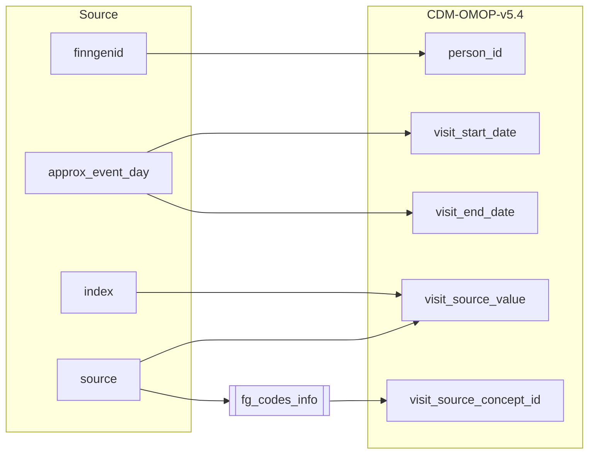
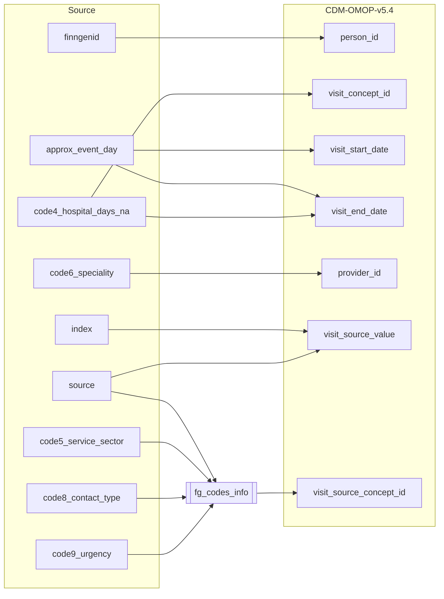
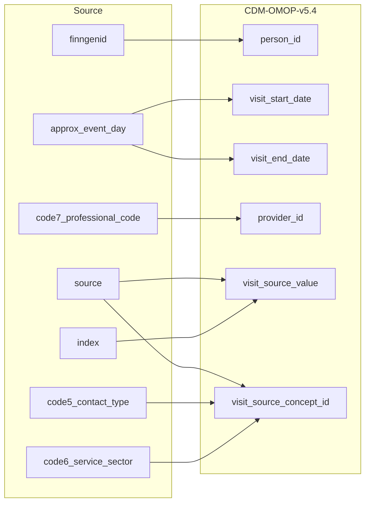
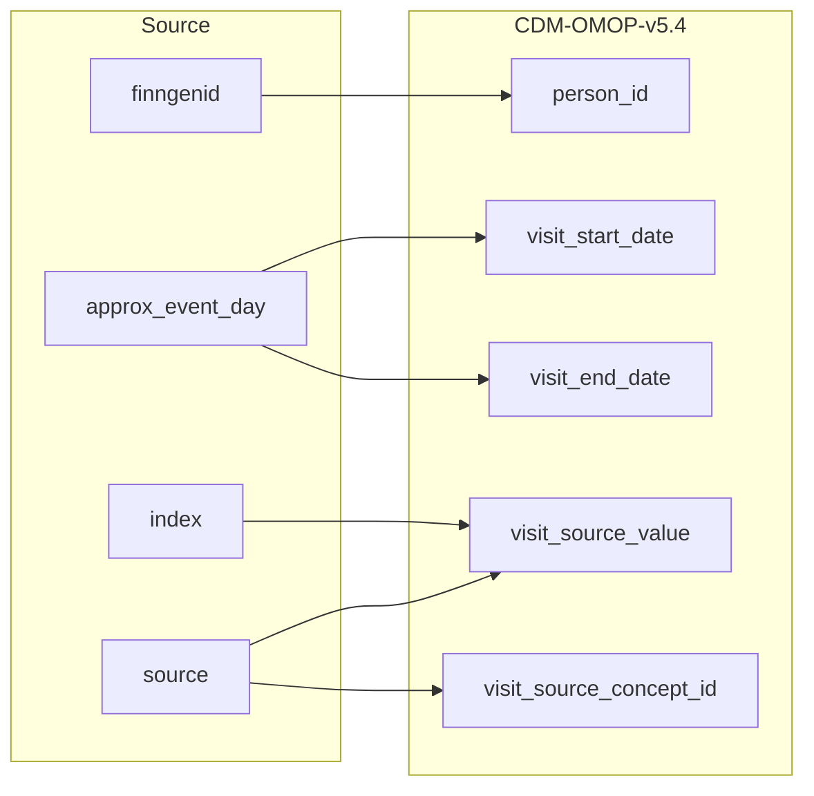

## Table name: visit_occurrence

### Reading from purch

| Destination Field | Source field | Logic | Comment field |
| --- | --- | --- | --- |
| visit_occurrence_id |  |  Incremental integer.     Unique value per combination of `source`+`index` | Generated |
| person_id | finngenid | `person_id` from person table where `person.person_source_value` equals `finngenid` |   Calculated|
| visit_concept_id |  | `concept_id_2` from concept_relationship table where `concept_id_1` equals `visit_source_concept_id` and `relationship_id` equals "Maps to"  | Calculated   NOTE: If a `visit_source_concept_id`  must have only one `visit_concept_id` |
| visit_start_date | approx_event_day | Copied from `approx_event_day` | Calculated |
| visit_start_datetime |  | Calculated from  `visit_start_date` with time 00:00:0000 | Calculated |
| visit_end_date | approx_event_day | Copied from `approx_event_day` | Calculated   NOTE: There is not `visit_end_date` in the source data, it is set same as `visit_end_date` |
| visit_end_datetime |  | Calculated from  `visit_end_date` with time 00:00:0000 | Calculated |
| visit_type_concept_id |  |  Set 32879  - 'Registry' for all | Calculated |
| provider_id |  |Set 0 for all | Info not available|
| care_site_id |  | Set 0 for all | Info not available|
| visit_source_value | source index |  String build as  "SOURCE=`source`;INDEX=`index`" | Calculated|
| visit_source_concept_id | source | `omop_concept_id` from fg_codes_info where `source` equals "PURCH"  | Calculated using the fg_codes_info table |
| admitted_from_concept_id |  | Set 0 for all  | Info not available  |
| admitted_from_source_value |  | Set NULL for all  | Info not available |
| discharged_to_concept_id |  | Set 0 for all | Info not available   |
| discharged_to_source_value |  | Set NULL for all | Info not available   |
| preceding_visit_occurrence_id |  | Set 0 for all  | Info not available   |

### Reading from hilmo

| Destination Field | Source field | Logic | Comment field |
| --- | --- | --- | --- |
| visit_occurrence_id |  |  | Generated:   Incremental integer.   Unique value per combination of SOURCE+INDEX. |
| person_id | finngenid |  | Calculated:  person.person_id where person.source_person_id is source.purch.finngenid  person.person_id where person.source_person_id is source.hilmo.finngenid  person.person_id where person.source_person_id is source.prim_out.finngenid  person.person_id where person.source_person_id is source.reimb.finngenid  person.person_id where person.source_person_id is source.canc.finngenid  person.person_id where person.source_person_id is source.death.finngenid |
| visit_concept_id | code4_hospital_days_na |  | Calculated:  Find standard concept_id in vocab.concept_relationship for the non-standard concept_id in cdm.visit_occurence.visit_source_concept_id.   For hilmo - If a visit_source_concept_id maps to more than one standard concept_id, then only one is chosen based on the number of hospitalisation days. |
| visit_start_date | approx_event_day |  | Calculated:  source.purch.approx_event_day  source.hilmo.approx_event_day  source.prim_out.approx_event_day  source.reimb.approx_event_day  source.canc.approx_event_day  source.death.approx_event_day |
| visit_start_datetime |  |  | Calculated:  visit_occurence.visit_start_date with time 00:00:0000 |
| visit_end_date | approx_event_day code4_hospital_days_na |  | Calculated:  If source.hilmo.source is hilmo and source.hilmo.code4_hospital_days is not null then visit_occurence.visit_start_date + source.hilmo.code4_hospital_days  else visit_occurence.visit_start_date |
| visit_end_datetime |  |  | Calculated:  visit_occurence.visit_end_date with time 00:00:0000 |
| visit_type_concept_id |  |  | Calculated:  For all 32879-Registry |
| provider_id | code6_speciality |  | Calculated:   For hilmo - provider.provider_id where source.code6_specilaity code exists in cdm.provider table.  For prim_out - provider.provider_id where source.code7_professional_code exists in cdm.provider table. |
| care_site_id |  |  | Info not available:  Set 0 for all |
| visit_source_value | source index |  | Calculated:  String with values in source and index fields as   "SOURCE=<source.SOURCE>;INDEX=<source.INDEX>" |
| visit_source_concept_id | source code5_service_sector code8_contact_type code9_urgency |  | Calculated:  For hilmo  - When source.code8_contact_type and source.code9_urgency is NULL then combination of source.source and source.code5_service_sector is used.  - When either source.code8_contact_type or source.code9_urgency is NOT NULL then combination of source.source, source.code8_contact_type and source.code9_urgency is used.  - When no standard map is available for a combination then only source.source is used.    For prim_out  - Combination of source.source, source.code5_contact_type, source.code6_service_sector is used.  - When no standard map is available for a combination then only source.source is used.    For purch, reimb, death, canc  - Only source.source is used. |
| admitted_from_concept_id |  |  | Info not available:   Set 0 for all |
| admitted_from_source_value |  |  | Info not available:   Set NULL for all |
| discharged_to_concept_id |  |  | Info not available:   Set 0 for all |
| discharged_to_source_value |  |  | Info not available:   Set NULL for all |
| preceding_visit_occurrence_id |  |  | Info not available:   Set 0 for all |

### Reading from prim_out

| Destination Field | Source field | Logic | Comment field |
| --- | --- | --- | --- |
| visit_occurrence_id |  |  | Generated:   Incremental integer.   Unique value per combination of SOURCE+INDEX. |
| person_id | finngenid |  | Calculated:  person.person_id where person.source_person_id is source.purch.finngenid  person.person_id where person.source_person_id is source.hilmo.finngenid  person.person_id where person.source_person_id is source.prim_out.finngenid  person.person_id where person.source_person_id is source.reimb.finngenid  person.person_id where person.source_person_id is source.canc.finngenid  person.person_id where person.source_person_id is source.death.finngenid |
| visit_concept_id |  |  | Calculated:  Find standard concept_id in vocab.concept_relationship for the non-standard concept_id in cdm.visit_occurence.visit_source_concept_id.   For hilmo - If a visit_source_concept_id maps to more than one standard concept_id, then only one is chosen based on the number of hospitalisation days. |
| visit_start_date | approx_event_day |  | Calculated:  source.purch.approx_event_day  source.hilmo.approx_event_day  source.prim_out.approx_event_day  source.reimb.approx_event_day  source.canc.approx_event_day  source.death.approx_event_day |
| visit_start_datetime |  |  | Calculated:  visit_occurence.visit_start_date with time 00:00:0000 |
| visit_end_date | approx_event_day |  | Calculated:  If source.hilmo.source is hilmo and source.hilmo.code4_hospital_days is not null then visit_occurence.visit_start_date + source.hilmo.code4_hospital_days  else visit_occurence.visit_start_date |
| visit_end_datetime |  |  | Calculated:  visit_occurence.visit_end_date with time 00:00:0000 |
| visit_type_concept_id |  |  | Calculated:  For all 32879-Registry |
| provider_id | code7_professional_code |  | Calculated:   For hilmo - provider.provider_id where source.code6_specilaity code exists in cdm.provider table.  For prim_out - provider.provider_id where source.code7_professional_code exists in cdm.provider table. |
| care_site_id |  |  | Info not available:  Set 0 for all |
| visit_source_value | source index |  | Calculated:  String with values in source and index fields as   "SOURCE=<source.SOURCE>;INDEX=<source.INDEX>" |
| visit_source_concept_id | code5_contact_type code6_service_sector source |  | Calculated:  For hilmo  - When source.code8_contact_type and source.code9_urgency is NULL then combination of source.source and source.code5_service_sector is used.  - When either source.code8_contact_type or source.code9_urgency is NOT NULL then combination of source.source, source.code8_contact_type and source.code9_urgency is used.  - When no standard map is available for a combination then only source.source is used.    For prim_out  - Combination of source.source, source.code5_contact_type, source.code6_service_sector is used.  - When no standard map is available for a combination then only source.source is used.    For purch, reimb, death, canc  - Only source.source is used. |
| admitted_from_concept_id |  |  | Info not available:   Set 0 for all |
| admitted_from_source_value |  |  | Info not available:   Set NULL for all |
| discharged_to_concept_id |  |  | Info not available:   Set 0 for all |
| discharged_to_source_value |  |  | Info not available:   Set NULL for all |
| preceding_visit_occurrence_id |  |  | Info not available:   Set 0 for all |

### Reading from reimb

| Destination Field | Source field | Logic | Comment field |
| --- | --- | --- | --- |
| visit_occurrence_id |  |  | Generated:   Incremental integer.   Unique value per combination of SOURCE+INDEX. |
| person_id | finngenid |  | Calculated:  person.person_id where person.source_person_id is source.purch.finngenid  person.person_id where person.source_person_id is source.hilmo.finngenid  person.person_id where person.source_person_id is source.prim_out.finngenid  person.person_id where person.source_person_id is source.reimb.finngenid  person.person_id where person.source_person_id is source.canc.finngenid  person.person_id where person.source_person_id is source.death.finngenid |
| visit_concept_id |  |  | Calculated:  Find standard concept_id in vocab.concept_relationship for the non-standard concept_id in cdm.visit_occurence.visit_source_concept_id.   For hilmo - If a visit_source_concept_id maps to more than one standard concept_id, then only one is chosen based on the number of hospitalisation days. |
| visit_start_date | approx_event_day |  | Calculated:  source.purch.approx_event_day  source.hilmo.approx_event_day  source.prim_out.approx_event_day  source.reimb.approx_event_day  source.canc.approx_event_day  source.death.approx_event_day |
| visit_start_datetime |  |  | Calculated:  visit_occurence.visit_start_date with time 00:00:0000 |
| visit_end_date | approx_event_day |  | Calculated:  If source.hilmo.source is hilmo and source.hilmo.code4_hospital_days is not null then visit_occurence.visit_start_date + source.hilmo.code4_hospital_days  else visit_occurence.visit_start_date |
| visit_end_datetime |  |  | Calculated:  visit_occurence.visit_end_date with time 00:00:0000 |
| visit_type_concept_id |  |  | Calculated:  For all 32879-Registry |
| provider_id |  |  | Calculated:   For hilmo - provider.provider_id where source.code6_specilaity code exists in cdm.provider table.  For prim_out - provider.provider_id where source.code7_professional_code exists in cdm.provider table. |
| care_site_id |  |  | Info not available:  Set 0 for all |
| visit_source_value | source index |  | Calculated:  String with values in source and index fields as   "SOURCE=<source.SOURCE>;INDEX=<source.INDEX>" |
| visit_source_concept_id | source |  | Calculated:  For hilmo  - When source.code8_contact_type and source.code9_urgency is NULL then combination of source.source and source.code5_service_sector is used.  - When either source.code8_contact_type or source.code9_urgency is NOT NULL then combination of source.source, source.code8_contact_type and source.code9_urgency is used.  - When no standard map is available for a combination then only source.source is used.    For prim_out  - Combination of source.source, source.code5_contact_type, source.code6_service_sector is used.  - When no standard map is available for a combination then only source.source is used.    For purch, reimb, death, canc  - Only source.source is used. |
| admitted_from_concept_id |  |  | Info not available:   Set 0 for all |
| admitted_from_source_value |  |  | Info not available:   Set NULL for all |
| discharged_to_concept_id |  |  | Info not available:   Set 0 for all |
| discharged_to_source_value |  |  | Info not available:   Set NULL for all |
| preceding_visit_occurrence_id |  |  | Info not available:   Set 0 for all |

### Reading from canc

| Destination Field | Source field | Logic | Comment field |
| --- | --- | --- | --- |
| visit_occurrence_id |  |  | Generated:   Incremental integer.   Unique value per combination of SOURCE+INDEX. |
| person_id | finngenid |  | Calculated:  person.person_id where person.source_person_id is source.purch.finngenid  person.person_id where person.source_person_id is source.hilmo.finngenid  person.person_id where person.source_person_id is source.prim_out.finngenid  person.person_id where person.source_person_id is source.reimb.finngenid  person.person_id where person.source_person_id is source.canc.finngenid  person.person_id where person.source_person_id is source.death.finngenid |
| visit_concept_id |  |  | Calculated:  Find standard concept_id in vocab.concept_relationship for the non-standard concept_id in cdm.visit_occurence.visit_source_concept_id.   For hilmo - If a visit_source_concept_id maps to more than one standard concept_id, then only one is chosen based on the number of hospitalisation days. |
| visit_start_date | approx_event_day |  | Calculated:  source.purch.approx_event_day  source.hilmo.approx_event_day  source.prim_out.approx_event_day  source.reimb.approx_event_day  source.canc.approx_event_day  source.death.approx_event_day |
| visit_start_datetime |  |  | Calculated:  visit_occurence.visit_start_date with time 00:00:0000 |
| visit_end_date | approx_event_day |  | Calculated:  If source.hilmo.source is hilmo and source.hilmo.code4_hospital_days is not null then visit_occurence.visit_start_date + source.hilmo.code4_hospital_days  else visit_occurence.visit_start_date |
| visit_end_datetime |  |  | Calculated:  visit_occurence.visit_end_date with time 00:00:0000 |
| visit_type_concept_id |  |  | Calculated:  For all 32879-Registry |
| provider_id |  |  | Calculated:   For hilmo - provider.provider_id where source.code6_specilaity code exists in cdm.provider table.  For prim_out - provider.provider_id where source.code7_professional_code exists in cdm.provider table. |
| care_site_id |  |  | Info not available:  Set 0 for all |
| visit_source_value | source index |  | Calculated:  String with values in source and index fields as   "SOURCE=<source.SOURCE>;INDEX=<source.INDEX>" |
| visit_source_concept_id | source |  | Calculated:  For hilmo  - When source.code8_contact_type and source.code9_urgency is NULL then combination of source.source and source.code5_service_sector is used.  - When either source.code8_contact_type or source.code9_urgency is NOT NULL then combination of source.source, source.code8_contact_type and source.code9_urgency is used.  - When no standard map is available for a combination then only source.source is used.    For prim_out  - Combination of source.source, source.code5_contact_type, source.code6_service_sector is used.  - When no standard map is available for a combination then only source.source is used.    For purch, reimb, death, canc  - Only source.source is used. |
| admitted_from_concept_id |  |  | Info not available:   Set 0 for all |
| admitted_from_source_value |  |  | Info not available:   Set NULL for all |
| discharged_to_concept_id |  |  | Info not available:   Set 0 for all |
| discharged_to_source_value |  |  | Info not available:   Set NULL for all |
| preceding_visit_occurrence_id |  |  | Info not available:   Set 0 for all |

### Reading from death_register

| Destination Field | Source field | Logic | Comment field |
| --- | --- | --- | --- |
| visit_occurrence_id |  |  | Generated:   Incremental integer.   Unique value per combination of SOURCE+INDEX. |
| person_id | finngenid |  | Calculated:  person.person_id where person.source_person_id is source.purch.finngenid  person.person_id where person.source_person_id is source.hilmo.finngenid  person.person_id where person.source_person_id is source.prim_out.finngenid  person.person_id where person.source_person_id is source.reimb.finngenid  person.person_id where person.source_person_id is source.canc.finngenid  person.person_id where person.source_person_id is source.death.finngenid |
| visit_concept_id |  |  | Calculated:  Find standard concept_id in vocab.concept_relationship for the non-standard concept_id in cdm.visit_occurence.visit_source_concept_id.   For hilmo - If a visit_source_concept_id maps to more than one standard concept_id, then only one is chosen based on the number of hospitalisation days. |
| visit_start_date | approx_event_day |  | Calculated:  source.purch.approx_event_day  source.hilmo.approx_event_day  source.prim_out.approx_event_day  source.reimb.approx_event_day  source.canc.approx_event_day  source.death.approx_event_day |
| visit_start_datetime |  |  | Calculated:  visit_occurence.visit_start_date with time 00:00:0000 |
| visit_end_date | approx_event_day |  | Calculated:  If source.hilmo.source is hilmo and source.hilmo.code4_hospital_days is not null then visit_occurence.visit_start_date + source.hilmo.code4_hospital_days  else visit_occurence.visit_start_date |
| visit_end_datetime |  |  | Calculated:  visit_occurence.visit_end_date with time 00:00:0000 |
| visit_type_concept_id |  |  | Calculated:  For all 32879-Registry |
| provider_id |  |  | Calculated:   For hilmo - provider.provider_id where source.code6_specilaity code exists in cdm.provider table.  For prim_out - provider.provider_id where source.code7_professional_code exists in cdm.provider table. |
| care_site_id |  |  | Info not available:  Set 0 for all |
| visit_source_value | source index |  | Calculated:  String with values in source and index fields as   "SOURCE=<source.SOURCE>;INDEX=<source.INDEX>" |
| visit_source_concept_id | source |  | Calculated:  For hilmo  - When source.code8_contact_type and source.code9_urgency is NULL then combination of source.source and source.code5_service_sector is used.  - When either source.code8_contact_type or source.code9_urgency is NOT NULL then combination of source.source, source.code8_contact_type and source.code9_urgency is used.  - When no standard map is available for a combination then only source.source is used.    For prim_out  - Combination of source.source, source.code5_contact_type, source.code6_service_sector is used.  - When no standard map is available for a combination then only source.source is used.    For purch, reimb, death, canc  - Only source.source is used. |
| admitted_from_concept_id |  |  | Info not available:   Set 0 for all |
| admitted_from_source_value |  |  | Info not available:   Set NULL for all |
| discharged_to_concept_id |  |  | Info not available:   Set 0 for all |
| discharged_to_source_value |  |  | Info not available:   Set NULL for all |
| preceding_visit_occurrence_id |  |  | Info not available:   Set 0 for all |

