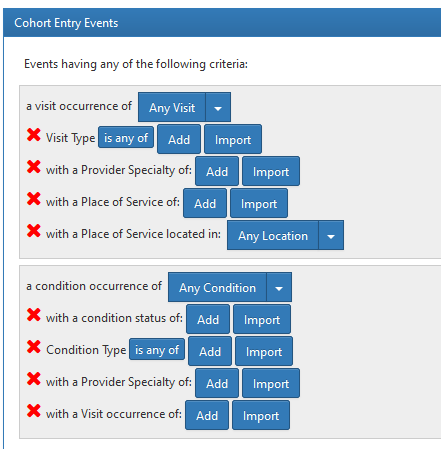

# Questions about the ETL 

Service sector data + covariates => OMOP CDM

## general
- are all fids in service-sector also in covaraites ?
- what is covariates:sex_imputed ??
- is code6_speciality the same for all diagnoses in the same index ?? (same for code 5 and 7) 

- service sector to : visit_concept_id ; 

## person
- bday = f(bl_year, bl_sex) ??
- race all as European 38003614 ??

## observation_period
- one period per person ??

## visit_occurence
- how is longitudinal:index calculated? can we use it as visit_id?
- visit_concept_id for the different registers

# mapping service sector 

### ATLAS filter options  
  

Hack: edit concept names to be easy to know what we use in FinnGen, for example add *

### filter option to CDM field

- visit occurence : visit_occurrence.visit_concept_id or visit_occurrence.visit_source_concept_id
- Provider speciality : provider.specialty_concept_id ; visit.provider_id ; concept_occurrence.provider_id
- ~~Place of service : care_site.place_of_service_concept_id~~
- condition status : condition_occurrence.condition_status_concept_id

### CDM field to longdata field

| SOURCE   | visit_concept_id                          | visit_source_concept_id     | specialty_concept_id             | condition_status_concept_id |
| -------- | ----------------------------------------- | --------------------------- | -------------------------------- | --------------------------- |
| INPAT    | SOURCE+code5_service_sector               | SOURCE+code5_service_sector | code6_specialty (erikoisala)     | Level                       |
| OUTPAT   |                                           |                             | code6_specialty   (erikoisala)   | Level                       |
| OPER_IN  |                                           |                             | code6_specialty  (erikoisala)    | Level                       |
| OPER_OUT |                                           |                             | code6_specialty  (erikoisala)    | Level                       |
| PRIM_OUT | code5_service_sector + code5_contact_type |                             | code7_profesional_code (ammatti) | Level                       |
| CANC     |                                           |                             | -                                | category                    |
| DEATH    |                                           |                             | -                                |                             |

# Howto on building cohort definitions

## select finngen register

to test

a visit occurence of : Any Visit
X Visit Source Concept: finngen concept_id

  

