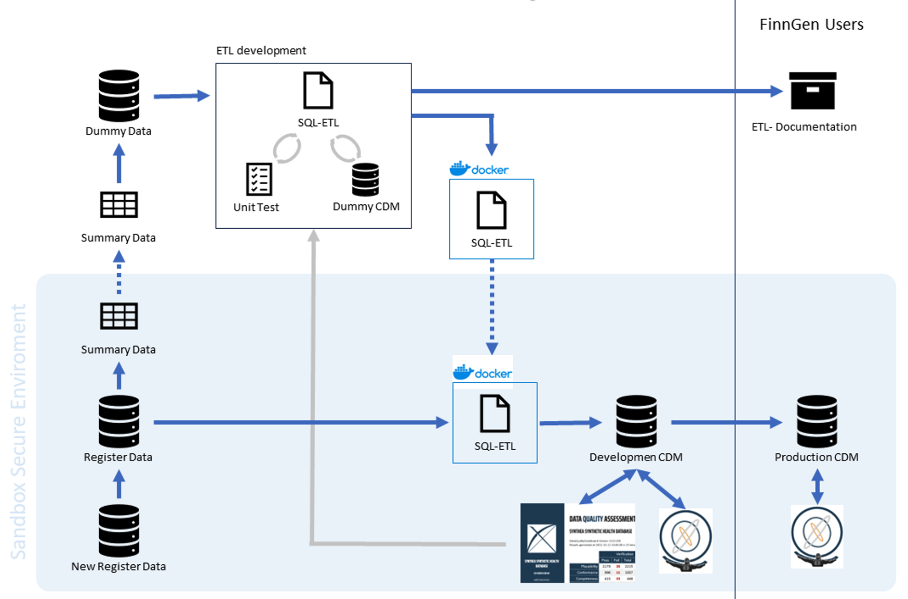

# FinnGen/FinRegistry ETL to OMOP CDM

In addition to 500,000 samples of genotype data, FinnGen is continuously expanding its register base phenotype data. 
We developed a process to transform current and incoming registers to the OMOP-CDM. 
This repository contains the ETL codes to carry the process and version control the addition of new registers. 

Following diagram show an overview of the process: 

All the personal data is kept in a secure enviroment, named Sandbox, where FinnGen users interact with it. 
However, for convenience ETL development is done outside the Sandbox. 

1. Personal `Register data` was, and `New Register data` will be, summarized into aggregated data that can be downloaded form the save enviroment. 
2. `Summary Data` is used to produce a dummy version of the source register data using our custom  [LongitudinalDummyDataGenerator](https://github.com/FINNGEN/LongitudinalDummyDataGenerator). 
3. `Dummy Data` is used to develop simultaneously the `SQL-ETL` scripts and the `ETL-documentation`. `SQL-ETL` scripts are validated manually by examining the output `Dummy CDM` and automatically by `Unit Test` scripts using the [RabbitInAHat test framework](http://ohdsi.github.io/WhiteRabbit/riah_test_framework.html),
4. Once the `SQL-ETL` are ready, they are wrapped together with the execution scripts into a Docker contained. 
5. The Docker container is used inside the safe enviroment to transform the source `Register data` into a `Development CDM`. 
6. The `Development CDM` is validated manually trough Atlas and automatically by the [DataQualityDashboard](https://ohdsi.github.io/DataQualityDashboard/). 
7. Once the `Development CDM` is ready, it is deployed to the `Production CDM` to be used by the users. 
8. Similarly, `SQL-ETL` and `ETL-documentation` are freeze as a GitHub release. Users can explore the production documentation in the [GitHub page](https://finngen.github.io/ETL/). 

## Folders structure 
#### 1_source_data  

`1_source_data/dummyDataGeneration/` folder contains the codes to generate the dummy source tables. 

`1_source_data/omopVocabularyToFGCodesInfo` folder contains the codes to generate the `fg_codes_info` mapping table from the OMOP-vocabulary tables downloaded from https://github.com/FinOMOP/FinOMOP_OMOP_vocabulary. 

#### 2 ETL specifications

We used `WhiteRabbit` to generate a scan report based on the original data. 
From scan report we removed the counts <50 and all the FinngenIds [./2_etl_documentation/scanreports/ScanReportFieldCount50_NoFIDs.xlsx](./2_etl_documentation/scanreports/ScanReportFieldCount50_NoFIDs.xlsx). 
We use `RabbitInAHat` to plan the ETL [./2_etl_documentation/etl_specs_rabbitinahat.json.gz](./2_etl_documentation/etl_specs_rabbitinahat.json.gz). 
This ETL draft produced some initial documentation in Markdown format. 

However, these files were transformed in to a more precise documentation using the [Just-the-Docs](https://just-the-docs.com/) framework.
Documentation is in [./2_etl_specifications/documentation/](./2_etl_specifications/documentation/). A Github action publish the main release in [finngen.github.io/ETL/](https://finngen.github.io/ETL/).

#### 3 ETL code 

Codes and scripts to aid in the development, testing, and deployment of the ETL from FinnGen registers to OMOP-CDM.

See [./3_etl_code/ETL_Orchestration/README.md](./3_etl_code/ETL_Orchestration/README.md) for details. 

