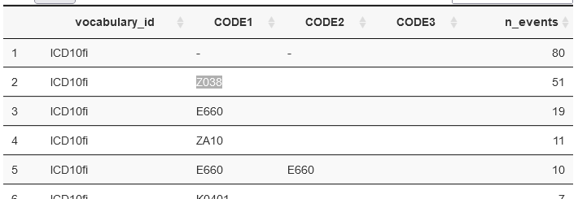
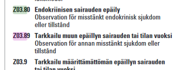
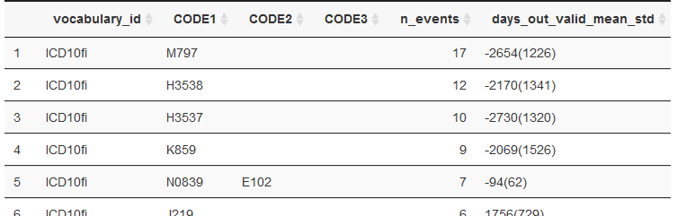

# Legend

❓QUESTION ; 💪TODO ; 👩‍⚕️HELP 

# Abstract 

ETL stands for Extract Transform Load. It is the general process of converting a data source into another. 
In this project the conversion is between the FinnGen data tables into the [OMOP-CDM](https://www.ohdsi.org/data-standardization/the-common-data-model/).  

For simplicity, we can compare the ETL between these two database to the translation of a book from Finnish to English.
Each event in the  FinnGen's source data can be compare to a sentence in the book. For its translation/ETL we follow two steps. 
Firstly, we need to translate the each word in the source vocabulary to the target vocabulary by means of a dictionary. 
In our case, translate **medical-codes** from Finnish vocabularies to the **OMOP-vocabulary** by means of **mapping-tables**. 
Secondly, we may need to rearrange the order of words from the source sentence into the target grammar. 
In our case, to place the information of each event in FinnGen data tables into the right table in the [OMOP-CDM v5.3.1](https://ohdsi.github.io/CommonDataModel/cdm531.html). 

To ensure the quality of the ETL, we need reliable code performing each of the steps (unit-test), clinical expertise supervising the translation, and quality control (QC) tools assessing the final output [[ETL creation best practices](https://www.ohdsi.org/web/wiki/doku.php?id=documentation:etl_best_practices)].  


# Steps 

## 0. pre done

This project assumes that :
 
- The FinnGen's source data has been already converted to the [FinnGenTableTypes](https://github.com/FINNGEN/FinnGenTableTypes) format and copied to BigQuery. *❓QUESTION: can we get this ready from register team ??* *❓QUESTION: for Timo: can we have this in BQ*
- The FinnGen's source data has already been through a minimal QC process. *💪TODO: I argue this will be very  easy to do in the FinnGenTableTypes format, for example using superset* *💪TODO: define the features to check*
- Finnish **vocabularies** and **mapping-tables** have been already created [Mapping-Finland](https://github.com/FINNGEN/mapping_finland), and accepted at the national level by the Finn-OMOP community. *💪TODO: I think this still need some pushing on my side, but just got on the right track*


## 1. FinnGen medical-codes to OMOP-vocabulary

Translate **medical-codes** from Finnish vocabularies to the **OMOP-vocabulary** by means of **mapping-tables**

For each Finnish vocabulary (ICD10fi, ICD9fi, NOMESCO, ...): 

### 1.1 Match FinnGen medical-codes to Finnish vocabulary

1. Get a count of text codes in the FinnGen data tables. 
2. Define matching rules (we start with the simples rule: exact same code)
3. Match codes to the Finnish vocabulary table
4. List codes that did not match sorted by count
5. 👩‍⚕️HELP: Consult medical expert on how to modify `2.` 

>Example: 
The current "List codes that did not match sorted by count" for ICD10FI (on the dummy 1k data, but same in real data): 
>
>
>
>Here we see that the second more often code not mapped in `Z03.8`. This code DOES NOT exists in the [ICD10fi vocabulary](https://www.julkari.fi/bitstream/handle/10024/80324/15c30d65-2b96-41d7-aca8-1a05aa8a0a19.pdf?sequence=1&isAllowed=y). 
>
>Should it be mapped to  `Z03.80` or to  `Z03.89` ??
>
>


### 1.2 Assess FinnGen events outside the valid period 
Finnish vocabularies include a range of time during which the code is consider valid. 

Once the FinnGen medical-codes in each event have been matched to the Finnish vocabulary we can check if the events are falling outside the validity period. 

> Example ICD10fi top 5 codes outside valid period:
>  


❓QUESTION: should we handle this or ignore it ??
👩‍⚕️HELP: medical expert. 

### 1.3 Assess mapping of the Finnish vocabulary to OMOP-vocabulary
Some codes in the Finnish vocabulary have 2 or more equivalents in the OMOP-vocabulary.

👩‍⚕️HELP: A medical expert should evaluate if only one or all are taken. 


## 2. FinnGen data tables to OMOP-CDM tables

Once all the medical codes have been properly matched. We need to move events info from the FinnGen data tables to the OMOP-CDM tables. OMOP-CDM v5.3.1 tables are defined [here](https://ohdsi.github.io/CommonDataModel/cdm531.html). 

### 2.1 Translate non-medical codes

In addition to the medical codes already translated to OMOP-vocabulary in step-1. Some tables need other non-medical codes in the OMOP-vocabulary. For example, a code for sex, for visit-type, for diagnose level, etc. 

👩‍⚕️HELP: A medical expert and/or register-team should help finding the best translation from the non-medical FinnGen data to OMOP-CDM. If a match is not found, also a vocabulary can be created. 

- **visit-type** : at the moment I have created a FinnGen  specific vocabulary for the visit-type. 👩‍⚕️HELP:❓QUESTION: is this the right thing to do ??
- **condition_status_concept_id**: a recent change in v5.3.1 is field `condition_status_concept_id`. This is similar to diagnose level in FinnGen. 👩‍⚕️HELP: However, I lack the experience to do the translation. 
- **Other fields**: 👩‍⚕️HELP: from register-team ❓QUESTION: is there other fields that can be filled with the current or additional info ?? 
- **BMI and smoking**: how to include this and at what time in patients history.  
- **emergency visit**


### 2.2 Transform data
Once all the previous steps are in place this is very easy. 

💪TODO: I SUGGEST: Run this in BQ for scalability (instead of R+postgres+BQ) ❓QUESTION:for Timo can we?. Unit test all the functions.  

👩‍⚕️HELP: from register-team: ❓QUESTION: Is there other useful info in the FinnGen source tables or in THL raw data that can be fit into any other table in the OMOP-CDM. For example from slack talking to Susanna: 
```
hilmo$OUTPAT <- as.numeric(hilmo$PALA!=‘’&as.numeric(hilmo$PALA)>9&hilmo$EVENT_YEAR>=1998)
```


## 3. Post-processing and QC

Once the OMOP-CDM database is ready, it needs three more post-processing steps. 

### 3.1 Eras
OMOP-CDM includes three *derived eras tables*: `condition_era`, `drug_era`, and `dose_era`. 
These tables summaries multiple consecutive events of the same type into one era. 
For example, if a patients has 10 diagnoses of asthma over the course of 2 years, it is converted into a one era starting at the first diagnose date and ending at the last diagnose date.   

At the moment `condition_era` is made joining conditions with gap less than 60 days, and `drug_era` joining drug purchases with a gap less than 120 days. *(TO CHECK: the omop-community typically uses 30 day for both, but this was not appropriated for us, we need to investigate this furhter )*. 

💪TODO: TO IMPROVE: A very good way to calculate `dose_era` once we have the VNR is using [PRE2DUP](https://pubmed.ncbi.nlm.nih.gov/25890003/)  

### 3.2 Achilles 
[Achilles](https://ohdsi.github.io/Achilles/) is an R code that can be ran in any database. 
It calculates the records counts and visual QC used by Atlas. 

### 3.3 Data Quality Dashboard 
[Data Quality Dashboard (DQD)](https://ohdsi.github.io/DataQualityDashboard/) is a tool build by the OHDSI community to perform advance quality  check in a OMOP-CDM database. 


>"This package will run a series of data quality checks against an OMOP CDM instance (currently supports v5.3.1 and v5.2.2). It systematically runs the checks, evaluates the checks against some pre-specified threshold, and then communicates what was done in a transparent and easily understandable way"


👩‍⚕️HELP: from register-team, medical expert:💪TODO: the output of the DQD has to be check with the help of medical experts. If problems found, these should be fixed in steps 1 or 3, or by register team in source data. 

