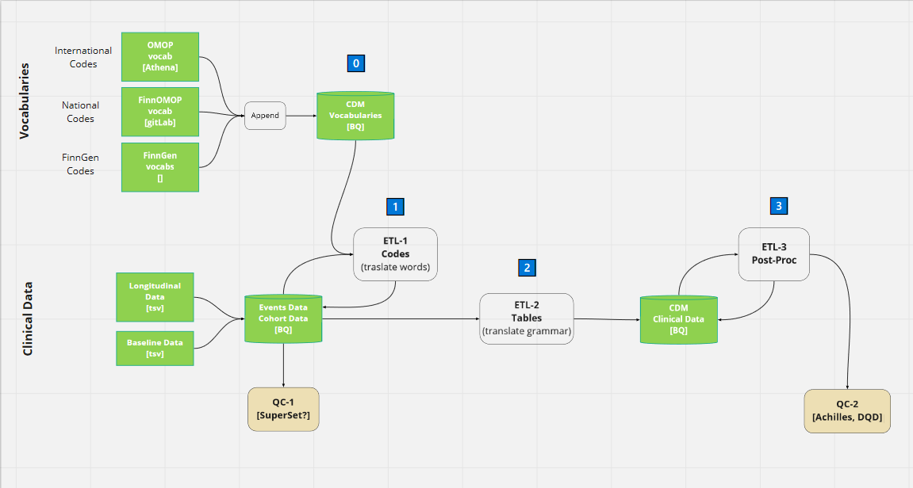

# Legend

❓QUESTION ; ✳️TODO ACTION 

# Abstract 

ETL stands for Extract Transform Load. It is the general process of converting a data source into another. 
In this project the conversion is between the FinnGen data tables into the [OMOP-CDM](https://www.ohdsi.org/data-standardization/the-common-data-model/).  

For simplicity, we can compare the ETL between these two database to the translation of a book from Finnish to English.
Each event in the  FinnGen's source data can be compare to a sentence in the book. For its translation/ETL we follow two steps. 
Firstly, we need to translate the each word in the source vocabulary to the target vocabulary by means of a dictionary. 
In our case, translate **medical-codes** from Finnish vocabularies to the **OMOP-vocabulary** by means of **mapping-tables**. 
Secondly, we may need to rearrange the order of words from the source sentence into the target grammar. 
In our case, to place the information of each event in FinnGen data tables into the right table in the [OMOP-CDM v5.3.1](https://ohdsi.github.io/CommonDataModel/cdm531.html). 

To ensure the quality of the ETL, we need reliable code performing each of the steps (unit-test), clinical expertise supervising the translation, and quality control (QC) tools assessing the final output [[ETL creation best practices](https://www.ohdsi.org/web/wiki/doku.php?id=documentation:etl_best_practices)].  

# Steps 

## Step 0 : CDM-vocabularies ready

Before we start we need to have the **vocabularies** and **mapping-tables** ready. In the book translation metaphor, this means we need to have the Suomi-sanakirja and Suomi-Englanti-sanakirja on the table. 

**vocabularies** and **mapping-tables** are from from three sources. International codes come from [Athena](athena.ohdsi.org/), OMOP's dictionary. National codes come from [Mapping-Finland](https://github.com/FINNGEN/mapping_finland), maintained by FinnOMOP. Codes only used in FinnGen come from us (e.g vist_type codes: Hilmo, avohilmo, etc)(e.g endpoints ??).  

**Actions**
- ✳️ On the National codes: Javier is writing a proposal to FInnOMOP on how to build this. 
- ✳️ On the FinnGen codes: Clinical expert has to agree how I have build the vist_type codes for FinnGen. 

## 1. FinnGen medical-codes to OMOP-vocabulary

Once the **vocabularies** and **mapping-tables** are ready, we use them to translate each medical code in the `detailed longitudinal data`.  In the book translation metaphor, this means use the dictionaries to translate the words in the book. 

1.1. **ETL-1 codes**: take each code in the `detailed longitudinal data`, finds the corresponding code in the **CDM vocabularies**, and adds this to a new column in the `detailed longitudinal data`.

1.2. After, this we can run a simple quality check **QC-1**. To plot events distribution over time for each source register (PRIM_out, INPAT, ...). Report on the codes that were not found in the **CDM vocabularies**. 

1.3. Check the top most used codes that were not found in the **CDM vocabularies** and edit  **ETL-1 codes** to translate them. See details in [A1](## A1: details on Matching FinnGen medical-codes to Finnish vocabulary)

**Actions**
- ❓ In my opinion optimal would be that Register-team provides the  `detailed longitudinal data` in a more workable format. For example, one row per event, original codes (e.g IDC10fi J23.3+D23.1 instead of current CODE1=J233 CODE2=D231), more in [FinnGenTableTypes](https://github.com/FINNGEN/FinnGenTableTypes).
- ❓ In my opinion optimal would be that Register-team provides the  `detailed longitudinal data`  already in the BigQuery. 
- ❓ In my opinion if the `detailed longitudinal data` is in BigQuery, this **QC-1** would be very easy to build in SuperSet, so that every one can see it in SandBox. 
- ✳️ Need medical expert to supervise step 1.3

## 2. FinnGen data tables to OMOP-CDM tables

Once all the medical codes have been properly matched. We need to move events info from the FinnGen data tables to the OMOP-CDM tables. In the book translation metaphor, this means re-arrange the position of the words to the target grammar. 

OMOP-CDM v5.3.1 tables are defined [here](https://ohdsi.github.io/CommonDataModel/cdm531.html). 

**Actions**
- ❓ In my opinion the optimal would be to run this directly in BQ (instead of R+postgres+BQ). 
-  ✳️ A medical expert has to supervise this step. Are we placing the info from the `detailed longitudinal data` columns into the right tables and columns in the OMOP-CDM ?? are we using the right codes?? is there more info that we can include (e.g emergency room visits, BMI, ets), more in [A2](## A2: details translate non-medical codes)

## 3. Post-processing and QC
Once the OMOP-CDM database is ready, it needs three more post-processing steps. 

3.1. Build eras: (e.g if there are X asthma diagnoses not further apart than 60 days, this is an era of asthma starting on the first diagnose and ending on the last )

3.2 Run Achilles: Calculates the record counts for Atlas and some visual QC [Achilles](https://ohdsi.github.io/Achilles/). 

3.3 Run Data Quality Dashboard : advance QC [Data Quality Dashboard (DQD)](https://ohdsi.github.io/DataQualityDashboard/)

**Actions**
- ✳️ A clinical expert + register-team assess the output of DQD and Achilles. If there is something odd we have to go and fix any of the previous steps. 
- optional: PRE2DUP to calculate eras

# Appendixes
## A1: details on Matching FinnGen medical-codes to Finnish vocabulary

1. Get a count of text codes in the FinnGen data tables. 
2. Define matching rules (we start with the simples rule: exact same code)
3. Match codes to the Finnish vocabulary table
4. List codes that did not match sorted by count
5. 👩‍⚕️HELP: Consult medical expert on how to modify `2.` 

>Example: 
The current "List codes that did not match sorted by count" for ICD10FI (on the dummy 1k data, but same in real data): 
>
>
>
>Here we see that the second more often code not mapped in `Z03.8`. This code DOES NOT exists in the [ICD10fi vocabulary](https://www.julkari.fi/bitstream/handle/10024/80324/15c30d65-2b96-41d7-aca8-1a05aa8a0a19.pdf?sequence=1&isAllowed=y). 
>
>Should it be mapped to  `Z03.80` or to  `Z03.89` ??
>
>

## A2: details translate non-medical codes

In addition to the medical codes already translated to OMOP-vocabulary in step-1. Some tables need other non-medical codes in the OMOP-vocabulary. For example, a code for sex, for visit-type, for diagnose level, etc. 

- **visit-type** : at the moment I have created a FinnGen  specific vocabulary for the visit-type. 👩‍⚕️HELP:❓QUESTION: is this the right thing to do ??
- **condition_status_concept_id**: a recent change in v5.3.1 is field `condition_status_concept_id`. This is similar to diagnose level in FinnGen. 👩‍⚕️HELP: However, I lack the experience to do the translation. 
- **Other fields**: 👩‍⚕️HELP: from register-team ❓QUESTION: is there other fields that can be filled with the current or additional info ?? 
- **BMI and smoking**: how to include this and at what time in patients history.  
- **emergency visit**

## A3 details in  Eras
OMOP-CDM includes three *derived eras tables*: `condition_era`, `drug_era`, and `dose_era`. 
These tables summaries multiple consecutive events of the same type into one era. 
For example, if a patients has 10 diagnoses of asthma over the course of 2 years, it is converted into a one era starting at the first diagnose date and ending at the last diagnose date.   

At the moment `condition_era` is made joining conditions with gap less than 60 days, and `drug_era` joining drug purchases with a gap less than 120 days. *(TO CHECK: the omop-community typically uses 30 day for both, but this was not appropriated for us, we need to investigate this furhter )*. 

💪TODO: TO IMPROVE: A very good way to calculate `dose_era` once we have the VNR is using [PRE2DUP](https://pubmed.ncbi.nlm.nih.gov/25890003/)  

👩‍⚕️HELP: from register-team, medical expert:💪TODO: the output of the DQD has to be check with the help of medical experts. If problems found, these should be fixed in steps 1 or 3, or by register team in source data. 

