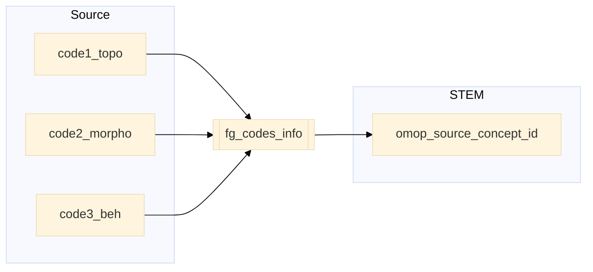

## canc to stem

| Destination Field | Source field | Logic | Comment field |
| --- | --- | --- | --- |
| finngenid | finngenid | Copied as it is | Copied |
| source | source |  Copied as it is | Copied |
| approx_event_day | approx_event_day | Copied as it is | Copied |
| code1 | code1_topo | Copied as it is | Copied |
| code2 | code2_morpho | Copied as it is | Copied |
| code3 | code3_beh | Copied as it is | Copied |
| code4 | | Set NULL for all | Info not available   |
| category | category | Copied as it is | Copied |
| index | index | Copied as it is | Copied |
| code |  |`code` from fg_codes_info where `vocabulary_id`=`vocabulary_id` and `code1`=`fg_code1` and `code2`=`fg_code2` and `code3`=`fg_code3` | Calculated|
| vocabulary_id |  | `vocabulary_id` is "ICDO3" | Calculated |
| omop_source_concept_id | | `omop_concept_id` from fg_codes_info where `vocabulary_id`=`vocabulary_id` and `code1`=`fg_code1` and `code2`=`fg_code2` and `code3`=`fg_code3` | Calculated|
| default_domain |  | Default domain is "condition"| Calculated |
