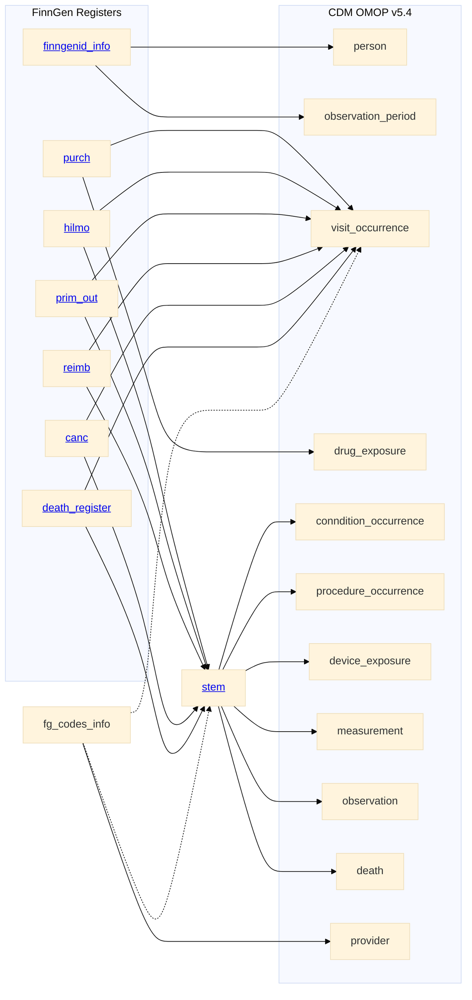

# FinnGen to OMOP CDM v5.4

In addition to genotype data, FinnGen includes the phenotype data from several national registers. 
This site details how the most relevant registers have been converted to the OMOP CDM v5.4. 

In addition to the international vocabularies provided by OMOP, we use national vocabularies build by the FinOMOP group, and few custom vocabularies build by FinnGen [[Appendix:Vocabularies]()]. As a result, most of the events in the clinical data tables have a `source_concept_id` that link to the source non-standard code. This makes the local codes searchable in Atlas and usable in local analysis [^fn1].    

Provided register data has been collected and preprocessed by the Finnish Institute for Health and Welfare (THL). Some of the original columns have been split and some have been merged together. To ease the code mapping, rather than reshape the large provided tables we use a mapping table `fg_codes_info`  [Appendix:Vocabularies]()]. 

Moreover, an intermediate `stem` table is used to collects all the medical events. Events are then placed in the different OMOP domain tables based on the domain of the medical code.   

# Registers

## finngen_info
Also know as `minimum_extended` is a file created by THL to collect participant details. 

- [finngen_info to person](finngenid_info_to_person.html)
- [finngen_info to observation_period](finngenid_info_to_observation_period.html)

## purch
Kela drug purchase registry (PURCH) contain the drug purchase at a pharmacy starting from 1995 [[FinnGen Handbook](https://finngen.gitbook.io/finngen-analyst-handbook/finngen-data-specifics/red-library-data-individual-level-data/what-phenotype-files-are-available-in-sandbox-1/detailed-longitudinal-data/registers-in-the-detailed-longitudinal-data#the-care-notification-system-hilmo)].

- [purch to visit_occurrence](purch_to_visit_occurrence.html)
- [purch to drug_exposure](purch_to_drug_exposure.html)

## hilmo
Hilmo register gather the secondary health care diagnose and operations from the country [[FinnGen Handbook](https://finngen.gitbook.io/finngen-analyst-handbook/finngen-data-specifics/red-library-data-individual-level-data/what-phenotype-files-are-available-in-sandbox-1/detailed-longitudinal-data/registers-in-the-detailed-longitudinal-data#hilmo-care-register-for-health-care)]. 

- [hilmo to visit_occurence](hilmo_to_visit_occurrence.htlm)
- [hilmo to stem](hilmo_to_stem.html)

## prim_out
Avohilmo register gather the primary health care diagnose and operations from the country. 
[[FinnGen Handbook](https://finngen.gitbook.io/finngen-analyst-handbook/finngen-data-specifics/red-library-data-individual-level-data/what-phenotype-files-are-available-in-sandbox-1/detailed-longitudinal-data/registers-in-the-detailed-longitudinal-data#avohilmo-register-of-primary-health-care-visits)]

- [prim_out to visit_occurence](prim_out_to_visit_occurrence.htlm)
- [prim_out to stem](prim_out_to_stem.html)

## reimb
Reimbursement register gathers [[FinnGen Handbook](https://finngen.gitbook.io/finngen-analyst-handbook/finngen-data-specifics/red-library-data-individual-level-data/what-phenotype-files-are-available-in-sandbox-1/detailed-longitudinal-data/registers-in-the-detailed-longitudinal-data#drug-reimbursement-data-the-social-insurance-institution-kela-kansanelaekelaitos)]. 

- [reimb to visit_occurence](reimb_to_visit_occurrence.htlm)
- [reimb to stem](reimb_to_stem.html)

## canc
Cancer register [[FinnGen Handbook](https://finngen.gitbook.io/finngen-analyst-handbook/finngen-data-specifics/red-library-data-individual-level-data/what-phenotype-files-are-available-in-sandbox-1/detailed-longitudinal-data/registers-in-the-detailed-longitudinal-data#finnish-cancer-registry)]. 

- [canc to visit_occurence](canc_to_visit_occurrence.htlm)
- [canc to stem](canc_to_stem.html)

## death_register
Death register [[FinnGen Handbook](https://finngen.gitbook.io/finngen-analyst-handbook/finngen-data-specifics/red-library-data-individual-level-data/what-phenotype-files-are-available-in-sandbox-1/detailed-longitudinal-data/registers-in-the-detailed-longitudinal-data#cause-of-death-data-statistics-finland)]. 

- [death_register to visit_occurence](death_register_to_visit_occurrence.htlm)
- [death_register to stem](death_register_to_stem.html)

## stem

## Fg_codes_info

[^fn1]: [M.Philofsky 2019](https://ohdsi.org/wp-content/uploads/2020/10/Melanie-Philofsky-Philofsky-Mapping-Source-Codes-Poster.pdf)