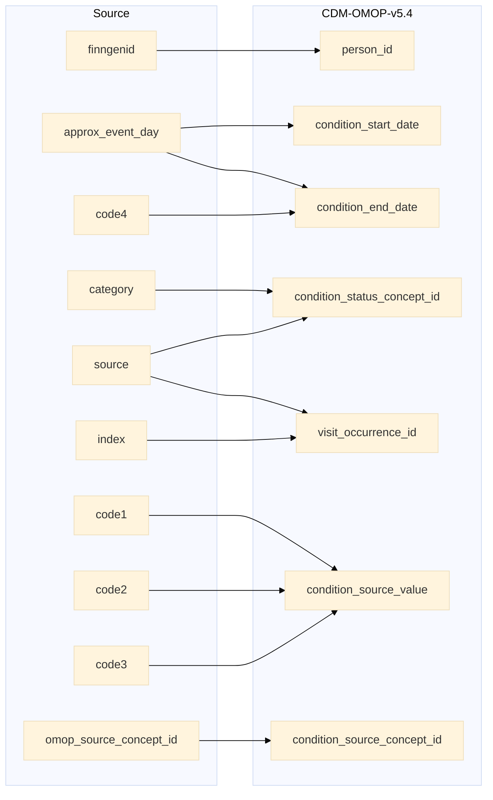

## stem to condition_occurrence

| Destination Field | Source field | Logic | Comment field |
| --- | --- | --- | --- |
| condition_occurrence_id |  |    Incremental integer.   Unique value per each row condition_occurence. | Generated|
| person_id | finngenid | `person_id` from person table where `person_source_value` equals `finngenid` |   Calculated|
| condition_concept_id |  | `concept_id_2` from concept_relationship table where `concept_id_1` equals `condition_source_concept_id` and `relationship_id` equals "Maps to"  | Calculated   NOTE: IF a `condition_source_concept_id` has more than one standard mapping (`concept_id_2`), one row is added per each additional `condition_concept_id` |
| condition_start_date |  approx_event_day | Copied from `approx_event_day` | Copied |
| condition_start_datetime |   | Calculated from  `condition_start_date` with time 00:00:0000 | Calculated |
| condition_end_date | approx_event_day | IF `source` in ("INPAT","OPER_IN","OPER_OUT","OUTPAT") and `code4` is not null then `condition_end_date` is `condition_start_date` + `code4`. ELSE `condition_end_date` is `condition_start_date` | Calculated |
| condition_end_datetime |  | Calculated from  `condition_end_date` with time 00:00:0000 | Calculated |
| condition_type_concept_id |  |  Set 32879  - 'Registry' for all | Calculated |
| condition_status_concept_id | source category | For `source` equals "INPAT" or "OUTPAT":   - IF number in `category` equals 0 then `condition_status_concept_id` is 32902-Primary diagnosis.   - IF number in `category` > 1 then `condition_status_concept_id` is 32908-Secondary diagnosis.  - IF number in `category` equals "EX" OR "EX0:N" then `condition_status_concept_id` is 32895-Death diagnosis.  For `source` equals "DEATH":  - IF `category` equals "U" then `condition_status_concept_id` is 32911-Underlying cause of death. - IF `category` equals "I" then `condition_status_concept_id` is 32897-Immediate cause of death.   - IF `category` equals "c1" or "c2" or "c3" or "c4" then `condition_status_concept_id` is 32894-Contributory cause of death. FOR `source` equals "REIMB":  - Set 32893-Confirmed diagnosis for all.  For `source` equals "CANC":  - Set 32902-Primary diagnosis for all. For `source` equals "PRIM_OUT":  - IF code in `category` equals  "ICD0" or "ICP0" then `condition_status_concept_id` is 32902-Primary diagnosis. - IF number in `category` equals "ICD1:N" OR "ICP1:N" then `condition_status_concept_id` is 32908-Secondary diagnosis. | Calculated |
| stop_reason |  | Set NULL for all | Info not available |
| provider_id |  | `provider_id` for mapped `visit_occurrence_id` from visit_occurrence table. | Calculated |
| visit_occurrence_id | source index | Link to correspondent `visit_occurrence_id` from visit_occurrence table where `visit_source_value` equals "SOURCE=`source`;INDEX=`index`". | Calculated |
| visit_detail_id |  | set NULL for all | Info not available |
| condition_source_value | code1 code2 code3 | String build as "CODE1=`code1`;CODE2=`code2`;CODE3=`code3`" | Calculated |
| condition_source_concept_id | omop_source_concept_id | IF `omop_source_concept_id` is not null then `omop_source_concept_id`  ELSE 0 | Calculated |
| condition_status_source_value |  | Copy `category` as it is | Copied  |