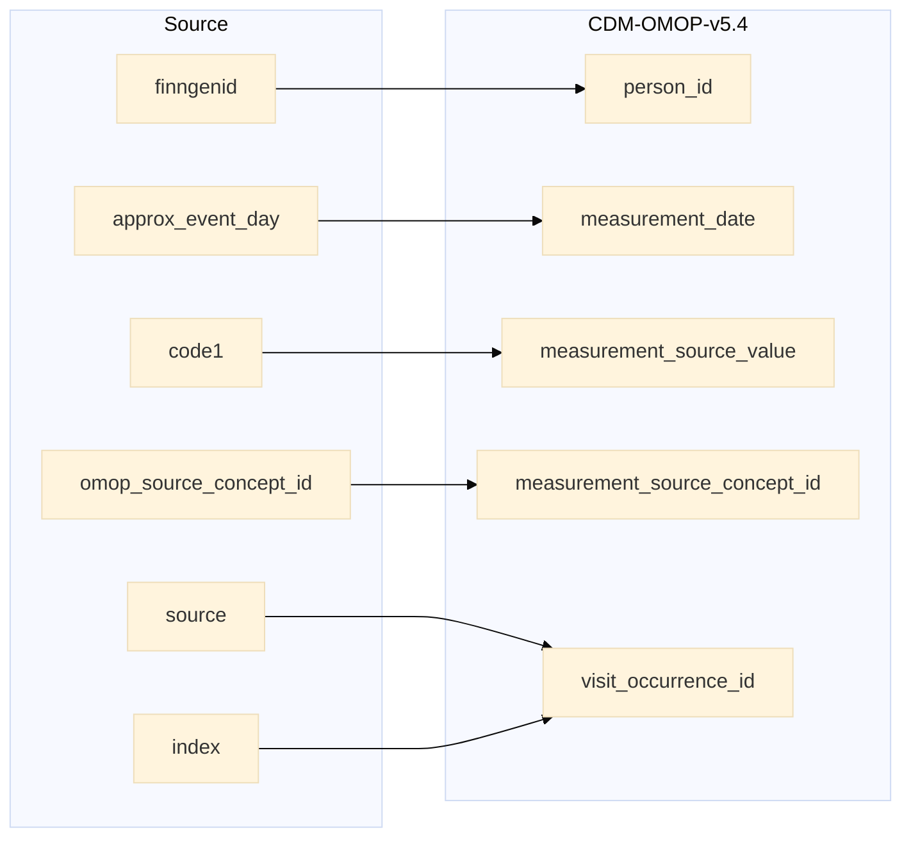

## stem to  measurement

| Destination Field | Source field | Logic | Comment field |
| --- | --- | --- | --- |
| measurement_id |  | Incremental integer. Unique value per each row measurement. | Generated |
| person_id | finngenid | `person_id` from person table where `person_source_value` equals `finngenid` |   Calculated |
| measurement_concept_id |  | `concept_id_2` from concept_relationship table where `concept_id_1` equals `measurement_source_concept_id` and `relationship_id` equals "Maps to" | Calculated   NOTE: IF a `measurement_source_concept_id` has more than one standard mapping (`concept_id_2`), one row is added per each additional `measurement_concept_id` |
| measurement_date | approx_event_day | Copied from `approx_event_day` | Copied |
| measurement_datetime |  | Calculated from  `measurement_date` with time 00:00:0000 | Calculated |
| measurement_time |  | Set 00:00:0000 for all | Calculated |
| measurement_type_concept_id |  | Set 32879 - 'Registry' for all | Calculated |
| operator_concept_id |  | Set 0 for all | Info not available |
| value_as_number |  | Set NULL for all | Info not available |
| value_as_concept_id |  | Set 0 for all | Info not available |
| unit_concept_id |  | Set 0 for all | Info not available |
| range_low |  | Set NULL for all | Info not available |
| range_high |  | Set NULL for all | Info not available |
| provider_id |  | `provider_id` for mapped `visit_occurrence_id` from visit_occurrence table. | Calculated |
| visit_occurrence_id | source index | Link to correspondent `visit_occurrence_id` from visit_occurrence table where `visit_source_value` equals "SOURCE=`source`;INDEX=`index`". | Calculated |
| visit_detail_id |  | Set NULL for all | Info not available |
| measurement_source_value | code1 | Copied `code1` as it is | Copied |
| measurement_source_concept_id | omop_source_concept_id | IF `omop_source_concept_id` is not null then `omop_source_concept_id`  ELSE 0 | Calculated |
| unit_source_value |  | Set NULL for all | Info not available |
| unit_source_concept_id |  | Set 0 for all | Info not available |
| value_source_value |  | Set NULL for all | Info not available |
| measurement_event_id |  | Set NULL for all | Info not available |
| meas_event_field_concept_id |  | Set 0 for all | Info not available |

